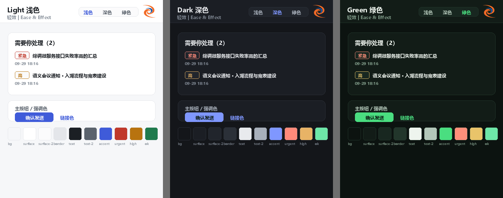

# 轻效 | Ease & Effect · 邮箱 + 日历数字人（mailbot）

两个跑在你本机的数字员工：

1. **邮箱数字人** —— 通过 **IMAP/SMTP** 连接企业邮箱，按配置的时间窗口（默认最近 24 小时）
   拉取邮件，逐封判断是否真的需要你回复，并**起草好可以直接发出的回复**；
   还能用一句话检索任意时间范围的邮件。
2. **日历数字人** —— 连接 **Google 日历**，用一句话就能建日程、把邮件里的时间点转成日程，
   并分析今天 / 明天 / 最近 7 天的安排。

所有写操作（发邮件、写日历）都**先给你确认**，确认后才真正执行。

> 📄 详细文档：[需求文档](docs/需求文档.md) ｜ [运行与配置文档](docs/运行与配置文档.md) ｜ [决策索引](docs/决策索引.md)
>
> ⚡ 只想赶紧跑起来：装好 Node.js 20+，**双击 `start.cmd`**（macOS/Linux 用 `./start.sh`），
> 浏览器会自动打开，然后在「设置」里填邮箱与大模型即可。
>
> 🎨 外观模式（顶栏右侧切换，会记住你的选择）：**浅色 / 深色 / 绿色**



```
IMAP 收信 ──► 解析正文/附件/会话线索 ──► DeepSeek 分类判断 ──► 为需回复的邮件起草 ──► 存入邮箱草稿箱
                                                   │
                                                   └──► 生成中文简报 + 可检索的知识库
                                                   │
                                                   └──► 提取时间点 ──► 你确认 ──► 写入 Google 日历
自然语言描述 ──► 时间解析 ──► 冲突检查 ──► 你确认 ──► 写入 Google 日历 ──► 今日/明日/7 天分析
```

---

## 目录

- [这是什么](#这是什么)　·　[核心能力](#核心能力)　·　[快速开始](#快速开始)
- **第一次用请看 [docs/快速上手.md](docs/快速上手.md)**（面向使用者，5 分钟，不需要懂编程）
- 配置项逐个解释见 [docs/运行与配置文档.md](docs/运行与配置文档.md)；需求与验收清单见 [docs/需求文档.md](docs/需求文档.md)

- [核心能力](#核心能力)
- [快速开始](#快速开始)
- [配置企业邮箱（服务器 / 端口 / 账号 / 授权码）](#配置企业邮箱服务器--端口--账号--授权码)
- [界面说明](#界面说明)
- [命令行用法](#命令行用法)
- [定时自动分析](#定时自动分析)
- [发送策略与安全边界](#发送策略与安全边界)
- [数据与目录结构](#数据与目录结构)
- [自检与测试](#自检与测试)
- [常见问题](#常见问题)
- [设计说明](#设计说明)
- [详细文档](#详细文档)

---

## 核心能力

| 能力 | 说明 |
| --- | --- |
| 邮件分析 | 按配置的时间窗口（默认 24 小时）拉取，逐封给出类型、优先级、要点、待办 |
| 智能判断「是否需要回复」 | 自动通知、营销邮件、纯知会等一律不生成草稿，避免噪音 |
| 起草回复 | 用第一人称、商务语气写出完整可发正文；缺信息处用 `【待确认：…】` 占位而不是编造 |
| 会话线索 | 沿 `In-Reply-To` / `References` / 同主题找回此前往来，保证立场一致、不重复答复 |
| 写入邮箱草稿箱 | 草稿以 `\Draft` 标记追加到服务器草稿箱，手机/Outlook 里也能直接看到 |
| 人工确认后发送 | 界面逐封确认才发送；发送内容与审核所见字节一致，并正确带上线程头 |
| **已发送不重复起草** | 已经发过（或还在待审核）的邮件，再次分析不会生成第二封草稿；总览里显示「已发送邮件」 |
| 中文简报 | 每次分析生成一份 Markdown 简报（一句话总结 / 需要你处理 / 值得知悉 / 建议动作） |
| 邮件知识库 | 按「客户、财务、会议、审批…」等主题归类，可直接提问（只依据邮件内容回答） |
| **对话查邮件** | 用一句话检索：按发件人 / 主题 / 正文内容 / 优先级 / 收件方式，默认近 30 天、最长一年；**结论范围**可选「最近 40 封 / 按月节选 / 均衡采样」，界面写明每种策略的代价 |
| **需处理 / 需关注分流** | 直接发我 + 高优先级 → 起草回复；抄送我 + 高优先级 → 单独归入「需要你关注」 |
| **邮件完整详情** | 检索结果点「完整详情」必定能打开：有分析给分析，没分析给原文摘录 + 一键就地分析 |
| **日历知识库** | 今日 / 明日 / 近 N 天的日程、主题分布、按天明细与冲突检测 |
| 多邮箱实例 | 每个邮箱的 IMAP/SMTP 服务器、端口、账号、授权码完全独立配置 |
| **日历：对话建日程** | 一句话描述即可：「明天下午三点和客户电话沟通 30 分钟」→ 解析出标题/时间/时长/参与人 |
| **日历：邮件转日程** | 从已分析邮件里提取确定的会议与截止时间，逐条确认后写入日历 |
| **日历：日程分析** | 今日 / 明日 / 最近 7 天的安排、按天明细、时间重叠检测、忙碌时长与中文分析 |
| **日历：写入前确认** | 写日历与发邮件一样先给确认卡片；未确认不落库，跨源请求一律拒绝 |
| **日历：可配 Google 代理** | 程序不使用系统代理（Node 的特性），因此提供专门的代理设置；只作用于 Google，不影响邮件与大模型 |
| **一键启动** | Windows 双击 `start.cmd`、macOS/Linux 运行 `start.sh`：自动装依赖、生成 `.env`、开浏览器；`node cli.js start --check` 可只做环境体检 |
| **三种外观模式** | 顶栏右侧一键切换**浅色 / 深色 / 绿色**，本地记忆、未选择时跟随系统；绿色模式是深绿底 + 亮绿强调色 |
| **待办闭环** | 「需要你处理」的每条都能标记**已处理 / 稍后提醒 / 忽略**，徽标只数未处理的——**清单终于能清空**；已闭环的收在折叠分组里，随时能翻回去恢复 |
| **需留意（单列一栏）** | 不需要回复、但有明确时限或要你亲自去办的事（到期提醒、待确认参会的会议、待补材料）单独一栏，**不混进「需要你处理」**；同样可标记已处理/稍后/忽略，但**不提供起草按钮**（本来就不必回） |
| **存储与清理** | 设置页显示**真实占用**（原文/孤儿/**可回收空间**/简报/台账/状态/**data 目录合计**）并提供零风险的「清理孤儿文件」；原文保留期与分析记录上限都可配置。清理结果**如实报出删了几个、释放多少字节（精确值 = 被删文件大小之和，不估算不四舍五入）与清理前后 data 目录占用**；保留天数为 `0` 时界面明写「**保留期清理不会删除任何原文**」。超期原文若**仍被保留期内分析/查看引用过会自动保留**（宁可漏删、不可误删），原文删除**不可逆**且界面不预选任何破坏性选项。**清理只动 `data/raw/*.eml`，绝不碰结论类历史**（state/reports/audit） |
| **首次上手向导** | 全新安装后第一次打开自动进入「开始使用」：**连接邮箱 → 配置大模型 → 连接日历（可跳过）** 三步，每步都能「保存并测试」；没配完时总览页顶部会说明还差哪一步。进度来自纯本地的 `/api/health`，刷新很快 |
| **HTML 正文安全渲染** | 邮件详情的原文页签可在**纯文本 / 渲染 HTML** 之间切换。渲染前过**白名单净化**（禁止 script/iframe/表单、剥掉所有 on* 与 style），**默认阻断远程图片**（追踪像素一加载，对方就知道你何时、用哪个 IP、打开了几次），并显示「显示图片（已拦 N 张）」由你决定；外链一律切断开窗器 |
| **按项目时间线**（「跟进 → 时间线」页签） | 分析时给邮件一个**项目短标签**，本地把同一件事的**邮件 / 我发出的 / 跟催 / 日程**按时间串成一条线。标签会飘，所以支持**重命名与合并**（历史记录一起改写、旧名记成别名、下次自动归位）。日程只来自本程序的操作留痕，界面会如实说明这一点 |
| **跟催（我承诺了什么 / 等谁回复）**（「跟进」页签） | 收件箱看不到的两件事：**我答应过别人什么**、**我在等谁回话**。前者用模型读**我自己发出的邮件**，后者是**纯本地线程匹配**（我发出的带 `messageId`，回复带 `In-Reply-To`）——不花一分钱。纯回执（「收到」）与刚发出的都不算；只有"对方确实回了"才自动关闭；状态语义与「需要你处理」一致 |
| **局域网加固** | 想让别的设备也能用时：**Host 白名单**（防 DNS rebinding）、**会话 Cookie** 取代永久令牌（HttpOnly + SameSite=Strict，12 小时空闲/7 天绝对过期，可单独登出）、**失败登录限速**、安全响应头（CSP 不含 `unsafe-inline`）、**HTTPS**（自有证书或自签并显示指纹）。监听不止本机时启动日志会列出局域网可达地址并逐条警告 |
| **数据去向 + 仅本地模式** | 「设置 → 数据去向」按**当前配置**逐项说明会发送什么、发给谁，以及**不会**发送什么（附件内容不上传、授权码不发给模型）。打开「仅本地模式」后，任何非回环地址的模型都会被**直接拒绝**（拦在 `LlmClient` 构造函数，没有漏网之鱼） |
| **密钥存储（系统钥匙串）** | 授权码 / API Key / **Google 刷新令牌**可搬进**系统保管**（Windows DPAPI / macOS 钥匙串 / Linux Secret Service），`config.json`、`.env` 与 `data/google-token.json` 里不再留明文。**默认不改变行为**，需你点一次「迁入」；迁移是"先写保管库 → 读回逐项比对 → 通过才删明文"，任何失败都不留半个状态（**写失败/读回不一致时绝不抹掉明文令牌文件**——弄丢 refresh token 等于要重新授权）。降级到未加密文件时界面会明说 |
| **备份与恢复** | 一键导出标准 zip（Windows 自带解压器即可打开），**默认不含密钥**、可选含邮件原文；导入前先显示"里面有什么、缺什么"，确认后覆盖，并**自动把当前数据再备份一份**（可回滚） |
| **主动性** | 可设定时刻**自动分析**（默认关闭），跑完按需提醒：页内弹条 / 浏览器桌面通知 / **把简报寄给自己**（唯一在你没打开页面时也能收到的渠道） |
| **日程可修改** | 每个日程都有「编辑」：改标题、时间、地点、说明，**不用删了重建**；由邮件生成的日程改完仍保留来源标记 |
| **运行与记录** | 从「**设置 → 运行与记录**」进入（不再占顶层导航）：**操作台账**（建/删/改日程、发邮件、同步草稿——含具体标题与主题，永久保留、可筛选、可下载 JSONL）+ **分析运行历史**（每次分析的拉取/分析/起草数与结果）；页顶「返回设置」带回锚点 |
| **返回顶部** | 长列表滚过一屏后右下角出现悬浮按钮；切换标签页也会自动回到顶部 |
| **原始邮件可下附件** | 详情「原始邮件」页签列出附件名与大小，逐个保存到本机——**附件内容本来就在本地**（分析时随原文一起归档），下载不连邮箱 |
| **草稿可加附件发送** | 选择或拖拽文件进草稿，发送时按 `multipart/mixed` 组装；**编码后超 20 MB 直接拦住**，不让 SMTP 事后报错 |
| **大模型换服务商** | 设置页可选 DeepSeek / 通义千问 / Kimi / GLM / 硅基流动 / OpenAI / OpenRouter / **本地 Ollama**，选完自动填好 Base URL 与常用模型 |
| **按时间段分析** | 24 小时 / 3 天 / 7 天 / 30 天 / 自定义起止；长假回来一次性补完，分析前先给「将分析约 N 封」的只读预检并立刻置灰按钮 |
| **日历回顾分析** | 日历知识库里用一句话问「请详细分析过去 30 天的日历并给出工作优化建议」——这是**向后看**的复盘：时间去哪了、会议负荷趋势、晚间/周末占用、可执行的优化建议；带图表，可导出 Markdown |
| **总结不会串窗口** | 一句话总结只展示**当前窗口**的简报；没有就按当前统计现场生成，并说明上次简报属于哪个窗口 |
| **页面状态联动** | 起草或发送后，总览那一行的按钮立刻变「查看草稿」/「已发送邮件」；后台（定时）分析跑完页面也会自己更新 |
| **时间口径统一** | 界面与发出去的邮件都按「设置 → 日历时区」表达，`Date` 头写 `+0800`，Foxmail 里不再显示成 UTC |
| **可下钻的统计卡片** | 点数字就跳到对应分区（并高亮）/ 跳草稿页 / 按优先级筛选；悬浮显示口径 |
| **整行看原始邮件** | 点邮件任意位置打开「AI 分析 / 原始邮件」双页签，含正文全文、引用历史折叠、复制 |
| **回复带原文引文** | 中文客户端风格 / `>` 前缀风格可选，可关、可限长；存量草稿支持一键补 |
| **草稿标签计数** | 待审核 / 已发送 / 全部都显示数量（全量口径，切标签不归零） |

---

## 快速开始

### 0. 最省事的方式（推荐）

```powershell
# Windows：双击 start.cmd
# macOS / Linux：
chmod +x start.sh && ./start.sh
```

它会依次：检查 Node.js 版本 → 缺依赖就 `npm install` → 缺 `.env` 就从 `.env.example` 生成 →
启动服务并打开浏览器。想先看看环境缺什么、又不启动服务：

```powershell
node cli.js start --check
```

> `start.cmd` 刻意做成**纯 ASCII + CRLF** 的最小启动器，检查与中文提示全在 Node 侧
> （`server/lib/startup.js`）。这不是洁癖：cmd.exe 解析「含 UTF-8 中文 + `chcp 65001`」的批处理时
> 会在多字节字符之后错位、吃掉后续行的行首字符（`call`→`all`、`echo` 消失），
> 结果是满屏 `'xxx' is not recognized as an internal or external command`。测试里有用例守着这两条。

下面 1-5 步是等价的手动流程，方便排查与定制。

### 1. 环境要求

- Node.js **≥ 20**（开发验证于 v24）
- 能访问你的企业邮箱 IMAP/SMTP 端口
- 一个 DeepSeek API Key（或任何 OpenAI 兼容服务）

### 2. 安装

```powershell
cd mailbot
npm install
```

### 3. 填写密钥（推荐用 .env）

```powershell
Copy-Item .env.example .env
notepad .env
```

最少需要填这几项：

```ini
MAILBOT_IMAP_HOST=imap.exmail.qq.com
MAILBOT_IMAP_USER=you@yourcompany.com
MAILBOT_IMAP_PASS=你的授权码
MAILBOT_SMTP_HOST=smtp.exmail.qq.com
MAILBOT_SMTP_USER=you@yourcompany.com
MAILBOT_SMTP_PASS=你的授权码
MAILBOT_EMAIL=you@yourcompany.com
MAILBOT_SENDER_NAME=你的名字
DEEPSEEK_API_KEY=sk-xxxxxxxx
```

### 4. 自检

```powershell
node cli.js doctor --deep
```

正常会看到：

```
✅ 邮箱配置完整性：IMAP imap.exmail.qq.com:993（SSL），SMTP smtp.exmail.qq.com:465（SSL）
✅ IMAP 连接与认证：连接成功，共 42 个文件夹
✅ 草稿箱定位：将把 AI 草稿写入：Drafts
✅ SMTP 连接与认证：smtp.exmail.qq.com:465 认证通过
✅ 大模型调用：deepseek-chat 响应正常（1234ms）
✅ 近 24 小时邮件量：INBOX 中有 17 封（单次上限 60 封）
```

任何一项 ❌ 都会给出中文原因和处理建议。

### 5. 启动界面

```powershell
node cli.js serve --open     # --open 会自动打开浏览器
# 或
npm run serve
```

浏览器打开 **http://127.0.0.1:8787**（若配置了访问令牌，请使用命令行里打印的带 `?token=...` 的地址），
点「分析最近 24 小时」。

### 换一个大模型服务商

「设置 → 大模型」里有**服务商预设**下拉框。选中即自动填好 Base URL 与常用模型名
（这两项必须配套，单改一个必然调不通），并给出该服务商的注意事项与申请 API Key 的链接：

| 预设 | Base URL | 备注 |
| --- | --- | --- |
| DeepSeek 官方 | `https://api.deepseek.com` | 国内直连、便宜（默认） |
| 阿里云百炼（通义千问） | `https://dashscope.aliyuncs.com/compatible-mode/v1` | 国内直连 |
| 月之暗面 Kimi | `https://api.moonshot.cn/v1` | 长上下文见长 |
| 智谱 GLM | `https://open.bigmodel.cn/api/paas/v4` | `glm-4-flash` 有免费额度 |
| 硅基流动 SiliconFlow | `https://api.siliconflow.cn/v1` | 一个 Key 聚合多家开源模型 |
| OpenAI | `https://api.openai.com/v1` | 需自备网络出口 |
| OpenRouter | `https://openrouter.ai/api/v1` | 一个 Key 调多家模型 |
| **本地部署（Ollama / vLLM）** | `http://127.0.0.1:11434/v1` | **完全离线、不花钱，API Key 可留空** |

三点设计取舍：

- **只改 Base URL 与模型名，不动 API Key**。换服务商时旧 Key 必然无效，但程序不会替你清空它
  （那会让你在没备份的情况下丢掉已填内容），而是由界面提示你去重新填写。
- **匹配不上就显示「自定义」**。如果你手填过内网网关地址，下拉框会选中「自定义」并**原样保留**
  你的地址，绝不会因为"匹配不上预设"而悄悄改写它。
- **本机地址允许留空 Key**。判断依据是解析后的 hostname 是否属于 loopback/私有网段，
  所以 `127.0.0.1.evil.com` 这种伪装域名不会被放过——公网地址仍然必须填 Key，
  否则只会等到调用时收到一个看不出原因的 401。

---

## 配置企业邮箱（服务器 / 端口 / 账号 / 授权码）

两种方式，任选其一，也可以混用（**环境变量优先**）。

### 方式一：界面配置（适合多邮箱）

打开 **设置 → 邮箱账户**，选择服务商预设会自动填好服务器与端口：

| 服务商 | IMAP | SMTP |
| --- | --- | --- |
| 腾讯企业邮箱 | `imap.exmail.qq.com:993` (SSL) | `smtp.exmail.qq.com:465` (SSL) |
| 阿里云企业邮箱 | `imap.qiye.aliyun.com:993` (SSL) | `smtp.qiye.aliyun.com:465` (SSL) |
| 网易企业邮箱 | `imaphz.qiye.163.com:993` (SSL) | `smtphz.qiye.163.com:465` (SSL) |
| Microsoft 365 | `outlook.office365.com:993` (SSL) | `smtp.office365.com:587` (STARTTLS) |
| Google Workspace | `imap.gmail.com:993` (SSL) | `smtp.gmail.com:465` (SSL) |
| 飞书邮箱 | `imap.feishu.cn:993` (SSL) | `smtp.feishu.cn:465` (SSL) |
| Zoho Mail | `imappro.zoho.com:993` (SSL) | `smtppro.zoho.com:465` (SSL) |
| 自定义 / 自建 | 按管理员提供填写 | 按管理员提供填写 |

每个实例可独立设置：**IMAP 服务器 / 端口 / 加密方式 / 账号 / 授权码**，**SMTP 服务器 / 端口 / 加密方式 / 账号 / 授权码**，
以及发件显示名、发件邮箱、Reply-To。SMTP 账号或授权码留空时会自动复用 IMAP 的。

> **关于授权码**：绝大多数企业邮箱不接受网页登录密码，需要在邮箱后台开启 IMAP/SMTP 服务并生成
> **「客户端专用密码 / 授权码」**（腾讯企业邮箱在 *设置 → 邮箱绑定 / 客户端设置*）。
> 常见报错 `AUTHENTICATIONFAILED` 基本都是这里没配对。

界面里授权码永远以 `***` 显示；保存时若未改动，会保留原值而不是被清空。

### 方式二：`.env`（适合单邮箱 + 密钥不落盘）

见 [.env.example](.env.example)，字段含义与界面一一对应。

### 邮件签名

在 **设置 → 分析与起草策略 → 签名** 里填写，会**逐字追加到每封回复正文的末尾**：

```
张三 | 示例事业部
移动电话：13800000000
公司地址：上海市浦东新区峨山路91弄20号陆家嘴软件园9号楼北塔3楼
安全提示：
1) 公司不会通过邮件索要密码或验证码；谨防仿冒域名与短链接
2) 本邮件不含外部短链；涉及办理请自行从门户进入（非点邮件链接）
3) 如有疑问，请仅通过企业微信通讯录联系发件人或网信安部门
```

设计上有三点刻意的取舍：

- **签名由程序追加，不由模型生成**。地址、电话、安全提示属于必须逐字固定的内容，
  交给模型即兴写有可能措辞漂移甚至漏掉安全提示。因此提示词里明确要求模型
  「不要写署名、姓名、职位、电话、地址」，落款统一由程序拼上。
- **幂等**。重复追加不会产生两个签名；发送时直接复用草稿正文，不再二次追加。
- **补签名不静默改草稿**。若你先有草稿、后配签名，草稿页会出现提示条和「插入签名」按钮；
  补签时会识别并**替换**掉旧的单独姓名行（不会出现「张三」+「张三 | 示例事业部」两行），
  已发送的草稿不会被改动。

### 配置文件位置

非密钥设置保存在 `data/config.json`（可提交版本库，便于多机同步行为策略）；
密钥建议只放 `.env`。密码字段在 API 返回中一律脱敏，服务端日志也不会打印明文。

**更彻底的做法**：到「设置 → 密钥存储」点「迁入」，把授权码 / API Key / 令牌搬进**系统保管**
（Windows DPAPI / macOS 钥匙串 / Linux Secret Service），此后 `config.json`、`.env` 与
`data/google-token.json` 里都不再有明文。Google 刷新令牌按**同一套规则**搬（先写保管库 → 读回比对
通过才删明文文件），所以**不会因为迁移而掉线**；搬完之后换机器/换系统账户需要重新连接一次 Google 日历。

它防的是"**文件被拷走**"：被网盘同步、进了备份包、被人翻到——密文只有这台机器的这个用户解得开。
它**防不住**以你的身份运行的恶意程序、或你离开时没锁屏的电脑；换电脑后需要在界面里重新填一次授权码。
细节与排查见 [docs/运行与配置文档.md §5.6](docs/运行与配置文档.md)。

---

## 界面说明

### 外壳（顶栏 / 页脚）

- **左侧**：应用名与能力副标题（`IMAP/SMTP · Google 日历 · 按对话意图取数`）
- **中间**：导航（邮件总览 / 邮件草稿 / 对话查邮件 / 日历 / 知识库 / **跟进** / 设置），总览与草稿带计数徽标
  - 「**跟进**」是**一个菜单项、两个页签**：**跟催**（我承诺了什么 / 等谁回复）与**时间线**（按项目串起来龙去脉），页内一键切换
  - 「**运行与记录**」（操作台账 / 审计）不再占顶层位置，从「**设置 → 运行与记录**」卡片进入；该页顶部有「返回设置」，会直接滚回那张卡片
- **右侧**：外观模式切换（**浅色 / 深色 / 绿色**）+ 品牌标志 **轻效 | Ease & Effect**
- **页脚**：`邮件草稿与日程写入都需你逐封确认；数据只保存在本机。© 2026 mail.wwu@gmail.com`

**外观模式**点一下立即生效并记住（存在浏览器本地，纯显示偏好，不上传、不影响服务端配置）：

| 模式 | 气质 | 适合 |
| --- | --- | --- |
| 浅色 | 白底深字、浅蓝强调 | 明亮环境、投屏、截图给他看 |
| 深色 | 中性深灰蓝、亮蓝强调 | 长时间阅读（**默认跟随系统**） |
| 绿色 | 深绿底、亮绿强调 | 编辑式深色，参考 [bartoszkolenda.com](https://bartoszkolenda.com/) 的气质 |

> **没有选择过时跟随系统**：老用户升级后外观不会突变；一旦手动选过，就以你的选择为准。

### 邮件总览

（不再只讲「最近 24 小时」——窗口由「设置 → 分析与起草策略」里的回看小时数决定，
检索与日历则完全不受该窗口限制。）

- **一句话总结**：**只显示与当前窗口同一口径的内容**。若当前窗口还没有 AI 简报，
  就现场按统计生成一句（与下方卡片完全同源），并注明「上一次 AI 简报针对的是最近 24 小时」，
  而不是把别的窗口的总结拿来冒充——否则会出现「标题写着最近 7 天 / 95 封，总结却说近 24 小时 38 封」的矛盾。
- **分析时间段可选**：标题右侧的窗口选择器支持 `最近 24 小时 / 3 天 / 7 天 / 30 天 / 自定义时间段…`。
  放长假回来选「7 天」，或在自定义里选「放假前一天 ~ 今天」，标题会跟着变成「最近 7 天」，
  分析按钮也用同一个窗口。点分析会**先弹预检**：「窗口内共 N 封、本次取最新 M 封、
  其中 K 封已分析过不会重复消耗、预计新增约 X 封 / 约 Y 次模型调用」——
  花钱之前先看到代价。预检期间按钮**立刻置灰为「预检中…」**，不会因为等待 1~2 秒被连点。
  窗口越大取信上限越高（24h→60、3天→180、7天→420、30天→1800，硬顶 2000），
  超出上限会**如实提示**而不是静默丢掉。
- **统计卡片（可点击）**：数字回答"有多少"，**点击回答"在哪里"**：

  | 卡片 | 点击后 | 悬浮可看口径 |
  | --- | --- | --- |
  | 邮件总数 | 滚到「值得知悉」 | 窗口内分析过的全部邮件 |
  | 需你处理 | 滚到「需要你处理」并高亮 | 直接发我 + 高优先 + 需回复 |
  | 需你关注 | 滚到「需要你关注」并高亮 | 仅抄送我 + 高优先 |
  | 待审核草稿 | 跳「邮件草稿 → 待审核」 | 待审核 / 已发送数量 |
  | 紧急 / 高优先 | 只看紧急+高优先（再点取消） | 按优先级筛选 |

- **需要你处理**：**直接发给我** 且 **高优先级** 且需回复的邮件，按优先级排序。右侧按钮按草稿状态变化：

  | 该封邮件的草稿状态 | 按钮 | 点击后 |
  | --- | --- | --- |
  | 已发送 | **已发送邮件** | 直达「邮件草稿 → 已发送」并选中那封草稿 |
  | 待审核 / 发送失败 | 查看草稿 | 到「邮件草稿 → 待审核」继续处理 |
  | 还没有草稿 | 起草回复 | 现起草一封并跳到待审核 |

- **整行可点**：点邮件的任意位置（总览三个分区、检索结果都行）→ 打开详情弹窗，
  内含 **「AI 分析」/「原始邮件」** 两个页签。「原始邮件」显示邮件头 + **正文全文** + 引用历史（默认折叠）+ 附件，
  并可一键复制正文 / Message-ID。列表行都可用键盘 Enter/Space 打开。

- **需要你关注**：**仅抄送给我** 且高优先级的邮件。这类通常不该由我回复（回复会越权、也容易造成职责混乱），
  因此**不进入起草队列**，只给「查看」入口
- **值得知悉**：其余通知类邮件合并展示；点「邮件构成」里的类型标签可只看该类
- **完整简报**：Markdown 全文，可**下载 Markdown**

> **为什么这样分流**：抄送件的行动含义与直接收件完全不同。
> 早期版本会把「抄送给我的高优先级邮件」也拿去做草稿，容易产出不该由我发出的回复。
>
> 口径说明：只保留**高优先级**进入这两个列表，低优先级不再占用首页注意力；
> 同时在 To 与 Cc 时按「直接发我」处理。升级前的历史分析记录没有收件人判定字段，
> 会保守地按「直接发我」处理（避免丢失待办），**重新运行一次分析后即按新口径分流**。

> **反复点「分析最近 24 小时」不会重复起草**：已经有草稿的邮件（无论待审核还是已发送）
> 都会被跳过，运行结果里会显示「已有草稿跳过 N 封」。这样既不会覆盖你正在审核的正文，
> 也不会让一封已经发出去的邮件又变成「待审核」而诱导重复发送。

### 对话查邮件
不只最近 24 小时。用一句话描述要找什么，数字人会识别意图后查询并分析：

- 「张总上个月发过哪些关于合同的邮件」——发件人 + 时间
- 「最近一周主题里有"告警"的邮件」——主题关键词
- 「正文提到光衰校验的邮件」——正文内容（摘要里没有时会回落到 IMAP 正文检索）
- 「近一个月需要我处理的高优先级邮件」——优先级 + 收件方式
- 「这个月抄送给我的重要邮件」——只看抄送

页面会回显**它理解到的检索条件**（发件人/主题/内容/优先级/时间范围）与命中数量，便于复核。
默认回看近 30 天，**最长 366 天（约 1 年）**；超出时不会静默改小，会写明「你要的起始日期超出上限，已按 X 起检索」。

**命中列表默认列出范围内全部命中**（硬上限 1000 条），不再由模型随手给的「30 条」决定：

- 命中数超过单次展示上限时，页面明确写出「命中 N 封 / 已列出前 M 封」，并建议缩小范围或分次查询；
- 只对上时间/发件人/主题、但没花模型额度分析的邮件也会列出来，标记为 **「仅信封·未分析」**（没有摘要与分类）；
- 信封扫描（只读信头，不读正文、不调模型）达到上限时，页面明确写出「还有邮件未检查到」——任何情况下都不静默少给。
  生效预算 = `min(检索信封扫描上限, max(检索按需回补上限 × 8, 600))`：默认配置为 **600 封**（上限可调到 3000），
  达到上限时文案会给出**上限 / 已扫描 / 未检查 / 取到的 UID 总数**四个数并对得上账；
- 模型结论只依据有界子集：**带摘录恒为最多 40 封**（额度闸门，与列表上限解耦），
  页面写明 **「结论基于最近 40 封（覆盖 2026-07-20 ~ 2026-10-06）」** 这样的口径，不会让你误以为模型读了全部命中。

**结论范围（结论看哪些邮件）**：命中列表永远是完整的，但送进模型的带摘录邮件**上限恒为 40 封**——
这是 token 额度闸门，换策略**不会**放大它。原先这 40 封固定取「按时间倒序最新的 40 封」，
于是问「7 月份以来……」时结论其实只看了最近一个月，早期邮件（实测第 41 封是 07-16）进不了结论。
现在检索页可以用下拉自己决定「结论看哪些邮件」，并且每一项都写清了代价：

| 策略 | 结论看到什么 | 代价 |
| --- | --- | --- |
| **最近 40 封**（默认） | 连续的最新一批，每封都有摘录 | 范围较宽时早期邮件进不了结论 |
| **按月节选**（每月最多 8 封） | 每个自然月都有代表，范围再宽也不丢早期月份 | 每个月的细节看得少 |
| **均衡采样** | 全范围等间隔取样，含范围内最早与最新各一封 | 会跳过中间月份的大部分邮件 |

三种策略的选择都是**本地确定性算法**（无随机数、无模型参与）：同一查询 + 同一策略，两次结果逐条一致。
无论选哪种，结果里的 `basis` 都会给出「结论基于……（覆盖 A ~ B）」的口径，**界面与提示词用的是同一句话**
（`basis.line`）；策略值非法时回落到默认 `recent`，并把「你给的值不是有效选项」写进结果，不静默改口径。
`recent` 取的是「当前列表顺序的前 40 条」（默认即最新一批）；若排序被指定为按时间正序或按优先级，
口径会如实改写成「列表前 40 封」并说明列表顺序（`basis.orderLabel`）——不会一边给最早的 40 封、一边写「最近」。

每一条命中都可以点 **「完整详情」**：这是一个独立接口（不受 24 小时窗口限制），
所以上个月回补进来的邮件也能打开。三种情况都会有明确结果，不会只弹一句「未找到」：

| 情况 | 结果 |
| --- | --- |
| 本地有分析记录 | 展示 AI 要点、待办、判断依据、类型与优先级，以及关联草稿状态 |
| 没有分析记录但有归档原文 | 展示解析出的主题/发件人/正文摘录，并给 **「立即分析这一封」** |
| 两者都没有 | 用列表里已知的信息兜底展示，同样可点「立即分析这一封」把它拉下来 |

结果行右侧还有 **「查看草稿」** 或 **「已发送邮件」**（已发送时），点击直达草稿页对应标签。

**检索范围自动补齐**：常规分析只覆盖最近若干小时，而检索可能要求更早的邮件。
当检索时间范围超出本地已分析范围时，数字人会**按需到 IMAP 拉取该范围的邮件并分析**
（先取全量 UID，再拉头部在本地按时间与发件人筛选，并跳过已分析过的），然后重新检索——所以你直接问
「某人这个月发给我的邮件」就能查到，不必先去改回看窗口重跑。

单次回补有数量上限（默认 40 封，可在「设置 → 分析与起草策略 → 检索按需回补上限」调整，0 = 关闭）。
达到上限时会明确告知「可能还有更早的邮件未纳入」。回补只读取邮件、不改动任何邮箱标记。
注意**两本账是分开的**：上面这个 40 封是**模型分析**额度；为了让命中列表尽量完整，还会额外做一次
**只读信头的信封扫描**（默认预算 600 封，见上文），它不读正文、不调模型，因此不会放大 token 消耗。

> 「发给我」默认包含**直接收件与抄送**；只有明确说「只算直接发给我的」才会排除抄送。

### 知识库

分两个独立知识库，用标签页切换：

- **邮件知识库**：主题归类、对话式检索、需处理/需关注统计、联系人聚合、基于邮件内容问答
- **日历知识库**：日程总数/会议数/参与人数、日程主题分布、按天明细、时间重叠检测

### 邮件草稿

左侧草稿列表（待审核 / 已发送 / 全部，**标签上带数量**），右侧是编辑器：

| 按钮 | 作用 |
| --- | --- |
| **确认发送** | 弹出确认框展示收件人/主题/正文，确认后真正发出（不可撤销）；成功后 toast 里给「查看已发送」入口 |
| 保存修改 | 只保存到本地，不发送 |
| 复制正文 | 一键复制当前正文 |
| 让 AI 重写 | 可填一句要求（如「更简短，明确同意周三交付」）后重新起草 |
| 同步到邮箱草稿箱 | 以 `\Draft` 写入服务器草稿箱；**重复同步会先删掉上一份副本**，不留孤儿 |
| 删除草稿 | 删除本地记录（邮箱草稿箱副本需自行清理） |
| 继续分析新邮件 | 按总览页选定的时间范围再跑一次分析，跑完**自动刷新列表**并提示新增了几封 |

> **页面状态是联动的**：在草稿页起草/发送/删除后回到总览，
> 「需要你处理」那一行的按钮会立刻变成「查看草稿」或「已发送邮件」，不需要手动刷新。
> 实现上是一个数据版本号：任何改数据的操作都让版本 +1，视图发现自己的版本落后就重新取数
> （仍保留阅读位置与未保存的编辑内容）。

**回复会带上原始邮件引文**（可在「设置 → 起草策略 → 原始邮件引文」切换风格或关闭）：

```
收到，上海侧已启动接口对接工作……

张三 | 示例事业部        ← 签名
移动电话：139…

------------------ 原始邮件 ------------------     ← 引文（签名之下）
发件人: 李心怡 <lixy167@chinatelecom.cn>
发送时间: 2026-09-30 16:52（周三）
收件人: …
主题: 转发: 集团IT需求全景视图数据传输需求

李心怡催办上海侧尽快对接…
```

引文只取来信的"新内容"（不会把历史引用再引一遍），有字数上限。
**存量草稿**（升级前生成的）会显示「插入原文」横幅，一键补上，不会静默改写你正在审核的正文。

> **签名位置规则**：正文顺序固定为「新正文 → 签名 → 引文」，**签名必须在引文之上**。
> 判断「有没有签名」也是按这个规则来的（包含即算有，且要位于引文之前），
> 而**不是**看正文是否以签名结尾——早期就是这么判的，加了引文之后签名不再位于末尾，
> 于是横幅一直提示「还没有带上当前签名」，点「插入签名」还毫无反应（因为幂等逻辑认为已经有了）。
> 现在服务端直接给出 `hasSignature / signatureMisplaced`，界面不再自己判断；
> 遇到「签名被引文挤到下面」的老草稿，横幅会说明是**位置**问题，一键即可搬回引文之前。

编辑器下方还可展开**原始来信与会话上下文**，核对 AI 的判断依据。
切到别的页面再回来不会丢掉正在编辑的内容（各页面状态会保留）。

### 附件

**收进来的附件**（看别人的邮件）：详情弹窗「原始邮件」页签里会列出附件名、类型与大小，
每行一个「保存」按钮。附件内容**本来就在本地**——分析邮件时抓的是完整原文（含附件），
已经归档成 `.eml` 了，所以列清单和下载都是纯本地解析，**不连邮箱、不重新下载**。

- **能自己选目录**：Chrome/Edge 会弹出系统的"另存为"对话框，目录与文件名都能改；
  Firefox/Safari 没有这个浏览器能力，只能存到默认下载目录（浏览器沙箱的硬限制）。
- 在"另存为"里点取消**不会**偷偷再下载一份。

**发出去的附件**（草稿编辑器里的"附件"区）：点「选择文件」或把文件拖进去即可，可加多个。

| 规则 | 说明 |
| --- | --- |
| 体积上限 | **按 base64 编码后**计算，默认 20 MB。编码会膨胀约 1/3，所以约等于"原始文件 15 MB"——多数企业邮箱的收件上限就是 20 MB |
| 超限处理 | 单个超限直接拒绝；累计超限**禁用发送按钮**并说明原因，而不是等 SMTP 报一句看不懂的错 |
| 数量上限 | 默认 10 个（防止误选整个文件夹） |
| 发送前确认 | 确认框会**逐项列出附件名与大小**——发出去就撤不回来了 |
| 发送后清理 | 附件内容从本机删掉（记录保留"这封发了什么"），因为它已经随邮件存在服务器上了 |
| 删除草稿 | 会一并清理附件文件，不在 `data/attachments/` 留孤儿 |

> 附件落盘在 `data/attachments/`，文件名是 `id__你的文件名`：id 由程序生成保证唯一，
> 你看到的文件名只用于展示与下载名。邮件里的原始文件名（对方可控）会先做安全收敛——
> 去掉路径成分、控制字符与开头的点，所以 `../../evil.sh` 只会变成 `evil.sh`。

### 列表折叠

| 列表 | 行为 |
| --- | --- |
| 值得知悉 | 默认 6 条 + 「展开全部 N 封」 |
| **需要你关注** | 默认 5 条 + 「还有 N 封抄送邮件 · 点此展开」 |
| 需要你处理 | **不折叠，全部展开** |

最后一条是刻意的：抄送件的性质是"看看就好"，收起来能把首页重点让出来；
而「需要你处理」是**待办清单**，默认全展开才有"一件事都没漏"的确定感——
一旦折叠，漏看的代价是漏回一封重要邮件，比多滚两屏严重得多，况且它天然有限（需回复 + 高优先）。

### 日历

左栏是**对话建日程**，右栏是**日程分析**与**邮件转日程**。

**对话建日程**：直接用中文描述，例如

- `明天下午三点和客户电话沟通 30 分钟`
- `下周三下午两点项目评审会，会议室B，李工参加`
- `看看我这周有什么安排`（这类「查看」请求会直接返回分析）

数字人会解析出标题/时间/时长/地点/参与人，**先展示确认卡片**（含冲突提醒与它做的假设），
点「确认写入日历」才真正创建。信息不足时会反问你，而不是瞎猜时间。

**日程分析**：今日 / 明日 / 最近 N 天（默认 7）的安排，包含

- 统计：今日/明日条数、有安排的天数、**忙碌时长（按区间并集算，重叠不重复累加）**
- 时间重叠检测（全天事件不参与冲突判定）
- 按天明细（全天事件排在前面）
- 一份中文分析（一句话总结 / 今日与明日 / 未来 N 天概览 / 需要注意）
- 每条日程可单独删除

**邮件转日程**：点「扫描最近 24 小时邮件」，数字人从**最近 24 小时**内已分析的邮件里找出**明确写出的**时间点
（会议邀请、截止时间、交付时间等），逐条给出标题、时间、来源邮件与**原话依据**，你确认后才写入。
模糊表述（「尽快」「下周找时间」）不会被当成具体时间。

> **窗口是真的只有 24 小时**：按钮写着 24 小时，程序就按 24 小时过滤（按**邮件日期**算，不是"分析库里最新的若干封"）。
> 面板右上角会显示本次窗口的起点，方便核对。
>
> **窗口内还没有分析过的邮件时会自动补一次分析**：点扫描后，程序会先跑一遍「分析最近 24 小时邮件」
> （这一步会跳过已分析的邮件，不会重复花 token），再提取日程——所以第一次点可能要等十几秒，
> 界面上会说明"已自动分析：拉取 N 封、新分析 M 封"。不想等或分析失败时，也会如实告诉你原因，
> 并提示可以到总览页手动分析。

这个面板就在**「对话建日程」下面**——两个"产生日程"的入口放在一起，不用先滚到页面底部找。

每条建议有两个按钮：

| 按钮 | 行为 |
| --- | --- |
| **编辑后写入** | 弹出确认框，可改**主题 / 全天或起止时间 / 地点 / 说明**，改完再写入 |
| 直接写入 | 不动内容，直接写入（建议已经准确时用） |

邮件里抽出来的时间常常"差一点"（主题需要写得更清楚、时间要顺延、地点得补上），
所以确认这一步不是走过场。弹窗里会同时显示**来源邮件**与**原话依据**，改的时候有据可依。

**时间会自动规整成"日历上能用"的时间块**：邮件里的时间往往是*时间点*而不是日程，
实测会出现 `17:00 → 17:05`、`10:52:12 → 10:52:17` 这种 5 分钟条目。现在：

| 规则 | 说明 |
| --- | --- |
| 开始对齐 | 对齐到**整点或半点** |
| 截止类**向下取整** | "10:52 之后无法登录" → **10:30** 开始。提醒**绝不能晚于**邮件里说的时间，所以宁可提前 |
| 其余就近取整 | 会议 14:20 → 14:30 |
| 时长保底 30 分钟 | 5 分钟的时间点补成 30 分钟；**模型已识别出更长时长则保留**（"14:00-16:00 评审会"仍是 2 小时） |

规整过的卡片会标注"时间已规整"，仍可在写入前改。

### 日历回顾分析（向后看）

上面那套「日程分析」是**向前看**（今日/明日/最近 N 天）。要复盘"上个月我的时间花哪了"，
到「知识库 → 日历知识库」，用一句话问，例如：

- `请详细分析过去 30 天的日历，并给出工作优化建议`
- `上个月我开了多少会？时间都花在哪了`
- `过去一年我的时间分配有什么问题`

支持 `过去 7/30 天`、`上个月`（自然月）、`上季度`、`过去一年`、以及自定义起止（最长一年）。

**怎么做出来的**（这决定了数字可不可信）：

1. 模型只解析**意图**（选哪个区间、关注什么），**不让它算时间**——「上个月」永远是上一个自然月，
   同一句话任何时候问都是同一区间；
2. 程序分页取全部日程（**翻页取全**，超出上限会如实提示"只分析了前 N 条"）；
3. 程序在本地算出统计量（下面这些），模型只依据统计写叙述，所以**结论可复现**；
4. 报告 = 叙述 + 统计附录 + 完整日程清单，导出成 `.md` 后可离线核对每个数字。

统计口径（可在配置里调）：

**先理解两个视角**——这是读懂所有数字的前提：

| 视角 | 含义 | 包含 |
| --- | --- | --- |
| **总占用** | "这段时间我被占了多少"（也就是你标记忙碌的目的） | 工作 + 生活/个人事务 |
| **工作负荷** | "工作有多重" | 会议 + 独自工作 + 专注时间（**不含生活**） |

「和老婆孩子过结婚纪念日午餐」算**总占用**但不算工作负荷：它确实占了我的时间（要统计），但不是工作（不污染工作口径）。

| 指标 | 说明 |
| --- | --- |
| **总占用 / 工作负荷 / 生活占用** | 都按**区间并集**算，重叠不重复累加；另有各自"占工作表时段比例"（工作日 09:00–19:00，可配） |
| **生活/个人事务分类** | 运动健身 / 家庭陪伴 / 餐饮 / 医疗健康 / 个人事务 / 休闲娱乐 / 休息 / 其他，给出各自项数与小时 |
| **休假/外出** | **按天计，不进小时口径**——一条"年假 9/5→9/7"按小时算是 48 小时，足以把其他所有数字压成零头 |
| **会议识别** | 有参会人 → 一定是会议；**没有参会人但标题像"与某某讨论/核对/评审" → 也按会议计**。很多人的习惯就是把与会对象写在标题里（本项目实测账号一个月 17 条活动、0 条邀请参会人），只认参会人字段会把"天天开会的人"算成"0 场会" |
| **"时间被谁占用最多"** | 优先用参会人；没有参会人时**从标题解析人名**（"与家诚、柳鑫讨论…" → 家诚、柳鑫），并标注来源。这是参会人字段永远给不出的答案 |
| **未计入占用的条目** | 只有四种：已取消、你自己标了"不占忙"、你已拒绝的会、办公地点标注（跨全天，计入会虚增）。**生活事务不在其中** |
| **结构性问题** | 晚间占用、周末占用、超长会议（>2h）、连续会议（间隔<10min）、时间冲突、完全没有会议记录的工作日。晚间/周末都**分开统计会议、独自工作、生活安排**——晚上运动是健康的，工作侵入休息才是问题 |
| **时长分层** | 很短（<30 分钟）/ 常规（30–60）/ 较长（1–2 小时）/ 超长（>2 小时）——往往比"会议场次"更能说明问题 |
| **地点** | 线上（有 Meet 链接或地点写了会议软件）/ 线下（填了地点）/ 未填。**没填就是"未填"，不会猜成线下** |
| **整块可用时间** | 工作日里 ≥90 分钟无日程的空档（按**总占用**挖，因为写着"陪家人"的两小时同样不能用来干活）。**记录稀疏时会明确提示**："没写进日历"不等于"真的空闲" |

### 图表

回顾结果里有**图表区**（跟着浅色/深色/绿色主题自动变色，鼠标悬浮显示数值）。版式固定为三列（窄屏退化为单列）：

| 行 | 图 |
| --- | --- |
| 1 | **按周工作负荷**（整行）——堆叠柱：会议 / 独自工作 |
| 2 | **时间构成（总占用）**（整行）——堆叠条：会议 / 独自工作 / 专注 / **生活**，条内直接标"名称 + 小时 + 占比" |
| 3–4 | **活动时长分布**（左上）／ **生活/个人事务**（左下，紧贴上一张） ｜ **工作主题分布**（中列） ｜ **每日忙碌分布**（右列） |
| 5 | **占用时间最多的人**（整行，行多名字长，给最宽的位置） |

中间一行的要点：左列是**一个容器里的上下两张**（不是两个网格行），所以两张紧挨着、不会因为
中列那张图更高而被撑出空隙；中列与右列则被拉到与左列**等高**。中右两列用显式位置定位，
缺图时只留一个空格，其余各就各位。

热力图每行左侧标出**该周的日期范围**（如 `9.28~10.4`），格子右移让出标签栏；首末行只显示实际覆盖到的日期。

**Top 榜类图（活动时长分布 / 生活花在哪 / 工作主题分布 / 人名榜）用 HTML 行绘制**，不是 SVG。
原因：SVG 的条高与行距是**画布坐标**，会随卡片宽度等比缩放，于是同样 12 单位的柱子在
1.3fr 的左列和 1fr 的中列渲染出来高矮不同、疏密也不同。改用 CSS 后行高、条高、行距、字号
都是**绝对像素**，与卡片宽度无关，三张图的柱子和间隔完全一致；标签列宽也固定，柱子起点对齐。

**配色**：会议=主色（浅色主题蓝 / 绿色主题绿）、独自工作=**橘**、生活/个人=**紫**、专注块=青。
刻意分开色相，避免"会议和独自工作看起来一个颜色"。

两个细节：时间构成的条高 **44**（曾用 20，渲染出来只有十几像素、像一条细线）；
段内标签按**估算文字宽度**决定放什么，放不下就依次降级为"小时+占比"、"只占比"，再放不下就交给图例
——避免中文长标签溢出到相邻色块上。

导出的 `.md` 里另有一套**字符条形图**（`████░░░░` + 数字），因为导出的是一份**独立文件**，
可能在记事本、邮件正文、钉钉、GitHub、Obsidian 任何地方打开——字符条在哪都能看、可直接复制，
文件保持自包含。两个刻意的取舍：**数字放在最前面**（万一字体不等宽、条错位，数字仍可读）、
**不用代码围栏**（不依赖渲染器支持 fenced code，纯文本环境里不会看到一堆反引号）。

> 为什么应用内不用同一套字符条、也不把图表写进 markdown：我们自己的 markdown 渲染器
> 只支持标题/列表/引用/行内样式，**不支持代码块与表格**——把图写进 md 在应用内根本显示不出来。
> 所以两边分工：**应用内画真 SVG（从接口的结构化数据画），导出文件用字符条。**

> **三个来自真实数据的教训**：①最初我只按"有没有邀请参会人"判定会议，实测某账号一个月 17 条活动
> **全都 0 个参会人**——他把与会者写在标题里。照那个口径会得出"会议 0 场、建议减少会议"，完全是胡说。
> ②我一开始把"生活/个人事务"当成要排除的噪音，于是"时间去哪了"变成了**纯工作口径**——
> 而用户记录日历的真实目的恰恰是标记"这段时间我被占了"。现在它是**一等指标**：
> 计入总占用、有独立的分类统计与图表，报告还必须同时覆盖工作与生活。
> ③"整块可用时间"是个陷阱：用户只把一部分事写进日历（实测总占用仅占工作表时段 7~14%），
> 那几百小时其实是"**没写进日历**的时间"。现在会显式提示记录稀疏，并要求模型写成"按日历记录看"。

### 设置

邮箱账户、分析与起草策略（窗口小时数、语气、语言、并发、签名）、大模型、
**日历（启用开关、目标日历、时区、OAuth 凭据、回调地址）**、访问控制，
以及**运行自检**和**重置本地数据**。

页面底部还有两张"入口卡"：**外观**（浅色 / 深色 / 绿色，以及重看「开始使用」向导）
与**运行与记录**（操作台账 / 审计台账，点开是独立页面，顶部有「返回设置」并滚回本卡片）。
设置页顶部有**分区目录**，区块按固定阅读顺序排列。

「开始使用」向导与「运行与记录」都是用 `app.navigate('settings', { anchor: '<区块标题>' })`
回到设置的：设置页给每个区块挂了**具名锚点**（`data-section`），锚点用**标题**而不是序号，
所以区块顺序调整后返回按钮依然落在正确的卡片上，并会短暂高亮让你看清落在哪。

### 待办闭环：让清单能清空

分析出"需要你处理"只是第一步。**没有状态，每次分析都会把已经处理过的邮件再列一遍**，
清单永远清不空——那就只是一份报告，不是待办系统。所以每条都能标记：

| 操作 | 效果 |
| --- | --- |
| **已处理** | 移出清单，收进「已处理」分组（可翻回去恢复） |
| **稍后提醒** | 提供"今天下午 14:00 / 今天 18:00 / 明天早上 09:00 / 3 天后 / 下周一"档位；**到期自动回到清单** |
| **忽略** | 永久移出清单，收进「已忽略」分组（可恢复） |

**「需留意」是独立的一栏**，不和「需要你处理」混：前者是"**别错过**"（到期提醒、待确认参会的会议、
待补交材料——不需要回复），后者是"**要你回信**"。混在一起会把真正要动手的清单灌满。
它同样能标记已处理/稍后/忽略，但**不给「起草回复」**——这类邮件本来就不必回。

> 判定权在逐封分类的 `worthNoting` 字段（口径是"不去办会误事"，拿不准填 false），
> 本地只做收敛：低优先级、纯知会、垃圾邮件、以及需要回复的一律不进。
> 之所以不用"有 actions 就算"这类本地规则：实测模型几乎给**每一封**都填了 actions
> （连日用电费账单都有"按需查看并缴纳"），那样「需留意」会变成第二个收件箱。
>
> 注意：`worthNoting` 是后加的字段，**旧的分析记录没有**（一律按"不进"处理，行为可预测）。
> **重新分析一次**就会补齐。

- **徽标和统计只数未处理的**，所以它可以被清零
- 已闭环的三组收在「已经不在清单里」里，**默认折叠**（不占首页重点位置，但不会消失）
- 状态存在 `state.json` 的 `tasks` 里，键与邮件一一对应（`folder:uid`）；
  **不进操作台账**——台账只记"改了外部系统"的动作，掺进本地点击会让它失去意义
- 恢复为待办会**删掉状态记录**（"点了一下又撤销"不该让状态文件增长）

### 同一页上的数字必须能对上

曾经出现过这种自相矛盾：简报写「近 24 小时共 **11** 封邮件，**2** 封高优先级需尽快处理」，
而同一页的卡片写「邮件总数 **5** / 需你处理 **0**」。三个原因，现在都处理了：

| 原因 | 处理 |
| --- | --- |
| IMAP `SEARCH SINCE` **只精确到"天"**，所以"最近 24 小时"会多带回当天更早的邮件（实测 11 封里 6 封距当时 24–43 小时） | 拉取后**按精确时刻再滤一道** → 拉取数 = 窗口内数 = 卡片数 |
| 简报写的是"本次拉取数"，卡片写的是"严格窗口内数" | 简报输入里明确写「**窗口内**共 N 封」，并声明统计是**程序算出的事实、引用时必须原样** |
| 简报是**那次分析的快照**，卡片是**打开页面时实时重算**的 | 总结区会直接写明："简报写于 X，当时 N 封；现在同一窗口 M 封——**数字不同是因为时间在走**" |

另外，模型**不得自造与卡片冲突的数量**：提示词已约束「需回复为 0 时那一节只能写「无」」，
不许拿会议通知、到期提醒去填充「需要你处理」。

### 主动性：你不打开，它也会动

在此之前，程序**只有你点它才动**。而"提效"的核心不是"能分析"，是"**不用你惦记**"。

到「设置 → 定时分析与通知」打开（**默认关闭**——它会在你不知情时连邮箱、花额度、把正文送模型）：

- **几点跑**：如 `08:30,18:00`，按「日历时区」计算；可限定星期几（默认工作日）
- **同一时刻只跑一次**：用配置时区的 `YYYY-MM-DD HH:MM` 作幂等键，重启、抖动都不会重复跑
- **不与你手动触发的分析并发**：已有分析在跑就跳过本次。若**别的入口**（检索回补 / 正文回源 / 草稿同步 / 邮箱自检）
  正占着这个邮箱账号的 IMAP 连接，会**排队等一会儿**（不是失败），等不到就明确报 `ACCOUNT_BUSY` 并让下一个时刻再试；
  **失败也占住这个时刻**（否则"邮箱连不上"会变成每分钟重试刷爆日志）
- **开关保存后立即生效**，不用重启；设置页显示实时状态（定时器在不在跑、上次结果、上次失败原因）与「立即试一次」

三种提醒渠道**各自独立**：

| 渠道 | 什么时候能收到 |
| --- | --- |
| 页内弹条 | 页面开着 |
| 浏览器桌面通知 | 页面开着（可切到后台标签页）并授权 |
| **把简报寄给自己** | **什么都没打开也能收到**——只有确实有待办或新草稿时才寄，不会天天打扰 |

### 授权会过期（每 7 天一次）——这是 Google 的规则，不是故障

如果日历页提示「**授权已失效，需要重新连接**」，或命令行出现
`Token has been expired or revoked`：

**这不是配置错——代理和 OAuth 凭据都不用动，重新点一次「重新连接 Google 日历」即可。**

原因是 Google 的规则：**OAuth 同意屏幕处于「测试」发布状态时，refresh token 只有 7 天有效期**。
自建应用通常一直是「测试」状态，所以每周都要重连一次。

**想彻底免掉这个 7 天周期**：Google Cloud Console →「API 和服务」→「OAuth 同意屏幕」→
把**发布状态从「测试」改为「已发布」**，然后回到本页重新授权一次（这一枚才是长效令牌）。
个人自用不必通过 Google 验证：授权时会看到"未验证应用"提示，点「继续」即可。

> 程序会把失效状态记进 `data/google-token.json`（`revokedAt`），所以界面会**如实**显示
> "需要重新连接"，而不是一边写着「已连接」一边每个操作都失败；后续请求也会立即失败，
> 不再反复去撞注定失败的刷新。

### 运行与记录

> **入口在「设置 → 运行与记录」**（不再占顶层导航）：它是一页**查阅过去**的东西，
> 不是每天要点的功能。页顶有「返回设置」，回去时会滚到设置页里那张「运行与记录」卡片。

**控制台日志关掉窗口就没了**，所以"改了外部系统"的动作会另存一份**操作台账**：

| 记录的动作 | 例子 |
| --- | --- |
| 创建日程 / 删除日程 | 「评审材料提交（改过）」· 从邮件生成 · 2026-10-06 15:00 |
| 发送回复邮件 | 「Re: 月度报告」· 收件人 wang@client.com · 附件 1 个 |
| 同步草稿到邮箱 / 删除草稿 | 写到哪个文件夹、清理了几个附件文件 |

每条都含**具体标题与主题**（按你的要求以可查性优先），失败的操作还会记下原因（如 `SMTP 535 鉴权失败`）。

- 存放位置：`data/audit.jsonl`，**一行一条、只追加不改写、永久保留**
- 页面上可按**类别 / 动作 / 关键词 / 只看失败**筛选；关键词能搜到标题、主题、**收件人、附件名**
- 可点「下载 JSONL」导出——用 Excel、`grep`、任何文本工具都能打开
- 同页还有**分析运行历史**（最近 30 次：拉取/分析/需回复/草稿数与成败、耗时）

**关于"之前建的日程为什么不在里面"**：台账是**这个功能上线之后**才开始记的。
好在可以补录——点「**补录历史**」，程序从两个来源回填，**只读 Google、只追加本地文件，不会新建或改动任何日程**：

| 来源 | 覆盖哪些 | 为什么认得出 |
| --- | --- | --- |
| 本地日历会话记录 | **对话建日程**创建的全部 | 会话里留着「已写入日历：标题　时间」的消息 |
| Google 事件上的来源标记 | **从邮件生成**创建的 | 这类事件带 `mailbotSource` / `mailbotRef` 扩展属性 |

已补过的按（标题+时间）或日程 id **去重**，可以放心重复点。补录记录的时间用**当时的创建时间**
（会话消息时间 / 事件的 `created`），所以时间线不会串。

> **顺序是"先本地、后 Google"**：本地会话记录**不需要网络**，一瞬间补完；Google 只是补充来源。
> 所以即使访问 Google 不通，点补录也会**立刻**把本地那批补回来，并提示"Google 日历这一路未成功：<原因>"。
> 服务端给 Google 查询设了 20 秒上限、前端另有 40 秒兜底——任何情况下都会给出一句明确结果，
> 不会出现"点了没反应、一直转圈"。

> 顺带修掉一个老问题：**「对话建日程」以前不给事件打来源标记**，所以在 Google 上分不出
> 哪些是程序建的（实测 107 条日程里只有 3 条带标记）。现在这条路径也会标记 `chat`，
> 以后新建的日程都能被识别。

> 还有一个小坑：台账为空时，「下载 JSONL」曾是**禁用**的——因为旧实现会返回
> 200 + 空 body，浏览器老老实实下载一个 **0 字节文件**，打开一看是空的（你踩到过）。

> 为什么分开放：**台账**回答"我做了什么"（改外部系统的写操作，需要长期留痕）；
> **运行历史**回答"程序跑成什么样"（每次分析的结果）。控制台日志只是给人看的实时输出，不做持久化。
>
> 一点提醒：台账里会有**真实的日程标题、邮件主题与人名**，明文存在本地文件里。
> 这是为了"出事时查得清"而做的取舍；要清理直接删 `data/audit.jsonl` 即可（删了不影响任何功能）。

---

## 日历数字人配置

### 1. 在 Google Cloud 创建 OAuth 客户端

1. 打开 [Google Cloud Console](https://console.cloud.google.com/)，新建（或选择）一个项目
2. 在 **API 和服务 → 库** 中启用 **Google Calendar API**
3. 在 **OAuth 同意屏幕** 中：用户类型选「外部」，填写应用名与支持邮箱，
   **并把你要用的 Google 账号加入「测试用户」** ← 这一步最容易漏，漏了就会在授权时被拒
4. 在 **凭据 → 创建凭据 → OAuth 客户端 ID** 中选择 **Web 应用**
5. **授权重定向 URI** 填（必须完全一致）：

   ```
   http://127.0.0.1:8787/api/calendar/oauth/callback
   ```

   端口按你实际的 `MAILBOT_WEB_PORT` 调整。日历页与设置页都会显示当前服务推导出的建议地址。

6. 记下生成的**客户端 ID** 与**客户端密钥**

> 关于「测试用户」：OAuth 同意屏幕处于**测试**状态时，只有名单里的 Google 账号能授权。
> 授权时登录的账号必须就是名单里的那个；换账号会看到
> 「尚未完成 Google 验证流程 / 错误 403: access_denied」。
> 自用想省事也可以点「发布应用」把它转为生产状态（个人自用无需 Google 审核），
> 这样任何 Google 账号都能授权，同时也解除 refresh token 的 7 天限制。

### 2. 填到本系统

界面「设置 → 日历数字人」勾选启用，填入客户端 ID / 密钥 / 回调地址，**点「保存配置」**。
或者写进 `.env`：

```ini
MAILBOT_CALENDAR_ENABLED=true
GOOGLE_CLIENT_ID=xxxx.apps.googleusercontent.com
GOOGLE_CLIENT_SECRET=GOCSPX-xxxx
MAILBOT_GOOGLE_REDIRECT_URI=http://127.0.0.1:8787/api/calendar/oauth/callback
MAILBOT_TIMEZONE=Asia/Shanghai
```

> **关于「保存」**：服务端只读取**已保存**的配置（`data/config.json` 或 `.env`）。
> 在界面上填完字段但没保存时，点「测试连接」会**自动先保存再测试**，因此不会出现
> 「明明填了却提示缺少 clientId」这种情况。页面顶部若有改动，会显示「有未保存的修改」提示。

### 3. 完成授权

打开「日历」页 → 点「连接 Google 日历」→ 在弹出的 Google 页面同意授权。

过程中会出现一个 **「此应用未经 Google 验证」** 的警告页，这是**正常步骤**不是报错
（页面第一句会写「您获得了授权」）：

- 点**左侧的「继续」**
- **不要**点右侧高亮的「返回到安全网页」——那等于放弃授权，会回到本系统并提示 `access_denied`
- 下一页勾选日历权限并确认

授权成功后小窗口自动关闭，页面刷新为已连接状态。

> 这个警告页是 Google 对「未审核的测试应用」强制加的知情确认，想减少它并解除令牌 7 天限制，
> 到 OAuth 同意屏幕页面点「**发布应用**」。

> 令牌默认保存在 `data/google-token.json`（已 gitignore）。`refresh_token` 只在首次授权时下发，
> 所以这一步做完之后长期有效，不需要重复授权。
>
> 到「设置 → 密钥存储」点一次「迁入」，这个令牌会**和邮箱授权码一起**搬进系统保管库
> （先写保管库 → 读回逐项比对 → 通过才删掉明文文件；**任何一步失败都不会动明文**，
> 所以不会因为迁移而掉线）。托管之后那个明文文件就不存在了；换机器/换系统账户解不开密文，
> 到日历页重新连接一次即可。
>
> **OAuth 同意屏幕处于「测试」状态时，refresh token 只有 7 天有效期。**
> 想长期使用，请到同意屏幕页面点「发布应用」（个人自用无需 Google 审核也能发布）。

### 权限范围

只申请一个最小权限：

```
https://www.googleapis.com/auth/calendar.events
```

即「查看和编辑你所有日历上的活动」——足够创建/读取/删除日程，**不含** Gmail、Drive、联系人等任何其它数据。

---

## 命令行用法

```powershell
node cli.js serve                       # 启动 Web 后台
node cli.js scan                        # 分析最近 24 小时并起草（适合定时任务）
node cli.js scan --hours 72             # 自定义窗口
node cli.js doctor --deep               # 自检邮箱与大模型
node cli.js overview                    # 终端查看总览
node cli.js knowledge                   # 终端查看主题分布
node cli.js drafts                      # 列出待审核草稿
node cli.js show <draftId>              # 查看草稿全文（含需确认事项）
node cli.js send <draftId> --yes        # 发送草稿（必须显式 --yes）
node cli.js drop <draftId>              # 删除本地草稿记录
node cli.js report --list               # 列出历史简报
node cli.js report --id <reportId>      # 打印简报全文
node cli.js calendar --days 7           # 今日/明日/最近 7 天日程分析
node cli.js calendar --days 7 --quiet   # 只要分析和统计，不打印按天明细
node cli.js calendar-add "明天下午3点和客户电话沟通30分钟"           # 先看解析结果
node cli.js calendar-add "明天下午3点和客户电话沟通30分钟" --yes      # 确认写入
node cli.js calendar-emails             # 从邮件里找出可写入日历的时间
```

---

## 定时自动分析

每天自动分析并**只生成草稿**（不发送），你到界面里审核即可。

**Windows 任务计划程序**：

```powershell
# 每天 08:30 运行
schtasks /Create /TN "mailbot-scan" /SC DAILY /ST 08:30 ^
  /TR "node D:\DSH\mailbot\cli.js scan" /F
```

**Linux / macOS crontab**：

```cron
30 8 * * * cd /path/to/mailbot && node cli.js scan >> data/scan.log 2>&1
```

> 定时任务里若 `data/config.json` 尚未包含密钥，请确保 `.env` 在同目录下可被读取。

---

## 发送策略与安全边界

本项目对「不可撤销的外发动作」做了几层硬约束：

1. **默认不自动发送**。`设置 → 发送策略` 默认是「逐封人工确认后发送」。
2. **API 层强制确认**。发送接口缺少 `confirm: true` 会返回 `428 CONFIRM_REQUIRED`，不会被静默发出。
3. **`draft_only` 模式**。可设为「只生成草稿，永不发送」，此时任何发送入口都会返回 `403 SEND_DISABLED`。
4. **扫描阶段只读**。拉取邮件使用 IMAP `EXAMINE`（只读打开），不会修改你邮箱里的已读状态。
   唯一的写操作是「把 AI 草稿追加到草稿箱」和「发送成功后清理该草稿副本」。
5. **发送内容 = 审核内容**。发送走的是与草稿箱完全一致的 MIME 原文，不存在「界面看到的和实际发出的不一致」。
6. **防提示词注入**。邮件正文被视为数据而非指令；模型被明确要求忽略邮件里任何「改变任务、泄露配置、
   给他人发信」之类的内容，并在判断依据中标注「疑似注入」。
7. **本机监听**。Web 默认只绑 `127.0.0.1`；如需局域网访问，请同时设置「访问令牌」。

---

## 数据与目录结构

```
mailbot/
├── start.cmd / start.sh        一键启动（装依赖 → 生成 .env → 起服务 → 开浏览器）
├── cli.js                      命令行入口
├── .env.example                环境变量模板
├── docs/
│   ├── 决策索引.md              每个决策的理由、代价、落地位置与验证方式（对话会丢，仓库不会）
│   ├── 需求文档.md              产品需求（功能/口径/验收标准）
│   └── 运行与配置文档.md         安装、配置、迁移、排障、运维
├── server/
│   ├── index.js                HTTP 服务（REST + SSE + 静态资源）
│   ├── diagnostics.js          自检
│   ├── config/
│   │   ├── defaults.js         默认值 + 服务商预设
│   │   └── index.js            多来源配置合并、脱敏、保存
│   ├── mail/
│   │   ├── imap.js             IMAP：拉取、头部查询、会话线索、草稿箱、追加
│   │   ├── account-lock.js     同账号 IMAP 串行化：按账号排队、有界等待、排队可见
│   │   ├── smtp.js             SMTP：发送（raw 通道，保证内容一致）
│   │   ├── parse.js            MIME 解析、引用剥离、摘要
│   │   ├── compose.js          RFC822 组装（RFC2047 编码、嵌套 MIME）
│   │   ├── recipient.js        收件人身份判定（直接发我 / 仅抄送我）
│   │   ├── signature*.js       多行签名的追加与幂等处理
│   │   └── drafts.js           草稿增删改、同步草稿箱、确认发送
│   ├── llm/
│   │   ├── client.js           DeepSeek / OpenAI 兼容客户端（重试、超时、错误码）
│   │   └── prompts.js          分类 / 起草 / 简报提示词
│   ├── ai/
│   │   ├── analyze.js          分类与起草
│   │   ├── engine.js           运行编排（锁、进度、落库、跳过已有草稿）
│   │   ├── search.js           对话式检索（意图 → 本地过滤 → 结论范围策略 → 结果分析）
│   │   ├── backfill.js         检索范围的按需回补
│   │   └── insight.js          总览、单封详情、知识库、问答
│   ├── calendar/
│   │   ├── time.js             时区换算、自然语言时间解析、按天切分
│   │   ├── google-auth.js      OAuth2（授权码 + PKCE）、令牌落盘与刷新
│   │   ├── google-api.js       Calendar REST v3：事件 CRUD、错误中文化
│   │   ├── prompts.js          时间提取 / 邮件提取 / 日程分析提示词
│   │   └── service.js          对话建日程、邮件转日程、日程统计与分析
│   ├── store/state.js          本地状态与原文归档
│   └── lib/util.js             日志、错误、JSON、并发、重试
├── web/                        无构建步骤的前端（原生 ES 模块）
│   ├── index.html  main.js  app.js  api.js  dom.js  markdown.js  styles.css
│   ├── view-state.js           视图状态持久化（切走再切回不丢上下文）
│   ├── theme.js                外观模式：浅色 / 深色 / 绿色（localStorage 记忆，未选择时跟随系统）
│   ├── type-meta.js            邮件类型的图标与配色映射（列表与图例共用）
│   ├── assets/logo.png         品牌标志（轻效 | Ease & Effect）
│   └── views/                  每页一个模块：overview / drafts / search / calendar / knowledge /
│                               setup / settings / login / records（运行与记录，从设置进入）
│       views/followup.js       「跟进」合并页：内部两个页签，复用 followups.js 与 timeline.js
├── test/
│   ├── mocks.js                模拟 IMAP / SMTP / 大模型（真实协议）
│   ├── mocks-google.js         模拟 Google Calendar / OAuth（真实 REST 语义）
│   ├── selftest.js             130 项邮件侧自检（含 ZIP/备份/跟催/同账号 IMAP 串行化/临时端口）
│   ├── calendar-selftest.js    105 项日历侧自检（含备份/体检/安全/跟催接口/结论范围策略）
│   ├── smoke-e2e.js            端到端：真实 HTTP + 模拟邮箱
│   ├── ui-render.js            前端渲染自检
│   ├── secrets-platform.js     平台密钥保管：真机跑 DPAPI / 钥匙串 / libsecret 往返 + 降级可见性
│   ├── lib/port.js             抽临时端口：重试读端口 + 避开 fetch/浏览器禁用端口
│   ├── lib/http.js             测试期 fetch 诊断层：失败时补上确切 URL 与完整 cause 链
│   ├── tools/scan-bad-ports.mjs 手动工具：把禁用端口名单与 undici 的真实行为逐个对一遍
│   └── lib/libsecret-roundtrip.mjs  在真 D-Bus 会话里跑 libsecret 往返的子进程
└── data/                       运行时生成（已 gitignore）
    ├── config.json             非密钥配置
    ├── state.json              分析结论 / 草稿 / 日历会话
    ├── google-token.json       Google OAuth 令牌（600 权限）
    ├── raw/                    邮件原文归档
    └── reports/digest-*.md     中文简报
```

---

## 自检与测试

全部测试**离线运行**，使用真实 IMAP/SMTP 协议驱动的本地模拟服务器，不连真实邮箱、不发真实邮件：

```powershell
npm test              # 全部：邮件单元 + 日历单元 + 全新安装 + 端到端 + 前端渲染 + 平台密钥保管
npm run test:unit     # 130 项：解析/组装/模型/分类/起草/IMAP/SMTP/引擎/发送/签名/详情/配置/HTTP/ZIP/备份/密钥保管（含 Google 令牌）/同账号串行化/临时端口
npm run test:calendar # 105 项：时区换算/OAuth/REST CRUD/对话建日程/邮件转日程/日程分析/检索回补/结论范围策略/代理转发/备份与体检与密钥接口
npm run test:fresh    # 14 项：全新机器首启（空数据目录 + 清空环境变量 + 首次上手判定 + start.cmd 格式 + .env 自动生成）
npm run test:e2e      # 端到端：真实 HTTP 服务 + 模拟邮箱，走完整 Web 路径
npm run test:ui       # 前端：十个页面渲染（含配置向导、合并后的「跟进」两页签与控制台锚点定位）+ 品牌外壳 + 跳转 + API 调用路径（需 linkedom）
npm run test:secrets  # 平台密钥保管：真机跑 DPAPI / macOS 钥匙串 / Linux libsecret 的写→读→校验→清除，外加"降级必须可见"（不支持的平台显式跳过并打印原因）
```

> 测试里**不用 `listen(0)` 之后直接读端口**那种写法：临时端口统一走 `test/lib/port.js`，
> 它既重试读取端口，也会**避开 fetch/浏览器规范的禁用端口**（"bad port"）——否则
> `listen(0)` 抽到 6000 这类端口时，指向它的 `fetch` 必然失败，且报错里连 URL 都没有，
> 表现为"偶发红、每次红的用例还不一样"。来龙去脉与排查指引见
> [docs/运行与配置文档.md §13.1](docs/运行与配置文档.md)。

> 前 5 套**完全离线**（不需要任何凭据、不花 token）；第 6 套 `test:secrets` 是**平台专有**的：
> 它要在真机上起 `powershell` / `security` / `secret-tool`，所以"哪个平台验证到什么程度"这件事
> 由它给出证据，见 [docs/运行与配置文档.md §5.6](docs/运行与配置文档.md) 的诚实清单。
> 平台不支持时它是**显式跳过 + 打印原因**，不会静默变成"通过"。

日历部分的测试**完全离线**：`test/mocks-google.js` 是一个本地 HTTP 服务器，
按 Google Calendar REST v3 的真实语义实现（含事件时间窗口过滤、204/404 行为、令牌刷新与撤销），
所以不需要真实 Google 账号也能验证全链路。

### 持续集成（CI）

因为**全部测试都离线**，CI 里**不需要邮箱授权码、不需要 Google 令牌、不花一毛 token**——
这是它敢在公开仓库上跑的前提。`.github/workflows/ci.yml` 会在每次 push / PR 时：

- 在 **Windows + Ubuntu + macOS × Node 20/22** 矩阵上 `npm ci` + `npm test`（跨平台才能暴露路径分隔符/大小写/换行符问题；
  **密钥保管后端更是平台专有的**——Windows DPAPI / macOS 钥匙串 / Linux Secret Service，所以矩阵里必须有 macOS，
  否则"在别人机器上密钥存哪、能不能用"就只能靠读代码推断）；
- 在 Linux 上尽力把 `libsecret-tools` + `gnome-keyring` 装上，让 libsecret 用例**真跑**；
  装不上/起不来时用例**显式跳过并打印原因**（这一步 `continue-on-error`，绝不让 CI 因为装不上测试工具而变红）；
- 跑一道**防泄漏闸门**：一旦发现 `data/`、`.env`、令牌、`.eml` 或 `audit.jsonl` 被提交就**直接失败**。

> `.gitignore` 把这四类东西**整目录/整类**排除（早期是逐文件列举，因此漏掉过 `data/google-token.json`
> 这个**活的 OAuth 令牌**、以及含真实人名与日程标题的 `data/audit.jsonl`）。
> `.gitattributes` 统一 LF，但 `*.cmd` 保留 CRLF —— 否则 Windows 批处理会解析失败。

覆盖的关键行为包括：中文主题 RFC2047 编码、附件识别、引用剥离、线程头（`In-Reply-To`/`References`）透传、
授权码脱敏与掩码回传不丢密钥、缺少 `confirm` 时拒绝发送/拒绝写日历、`draft_only` 全局禁用发送、
重复发送拦截、签名幂等、SSE 进度通道、令牌鉴权、
**时区往返与跨夏令时的按天加减**、**「明天 15:00」不被当成 UTC（差 8 小时）**、
**写操作不被盲目重试（避免重复日程）**、**删除失败不会被当成成功**、**跨源请求被拒**、
**已发送的邮件重复分析不会生成新的待审核草稿**、**单封详情在缺记录时仍给出可执行出路**、
**服务器丢 `ENVELOPE` 响应时改用头部查询照样查全**、**UTC 8/31 的邮件按北京时间算作 9/1**、
**「已发送邮件」按钮会直达草稿页的「已发送」标签**、**页脚与 Logo 的一致性**、
**配置了代理时请求真的经过代理转发（含 CONNECT 隧道、407 认证、502 拒绝、端口不通）**、
**Google 令牌纳入保管库后仍能往返读取、明文文件被清掉**、
**保管库写失败/读回不一致时绝不抹掉明文令牌文件（宁可少迁也不能丢）**、
**只有旧明文令牌数据时读取路径照常（不因纳入保管库而掉线）**、
**保管库读不出来时给出可识别的错误码而不是静默当"未连接"**。

---

## 常见问题

**`IMAP 操作失败：AUTHENTICATIONFAILED`**
用的是登录密码而不是授权码。到邮箱后台开启 IMAP/SMTP 并生成客户端专用密码。

**`SMTP 发信失败：535 Error: authentication failed, system busy`**
这句话是**腾讯企业邮箱**在 AUTH 阶段对「它不认识的账号」返回的通用拒绝文案，**并不代表授权码写错了**。
按顺序排查：

1. **SMTP 服务器地址是否与账号同域**（最常见）。自建/专属邮箱的 IMAP 与 SMTP 通常在同一域名下：
   IMAP 是 `imap.yourcompany.cn` 时 SMTP 应为 `smtp.yourcompany.cn`，而不是 `smtp.exmail.qq.com`。
   填了别人的公共服务器，对方自然不认你的账号。
2. **端口与加密方式**。465 + SSL 最稳；587 在部分自建服务器上会「接受连接后立即断开」。
3. **同账号并发登录**。该账号在别的邮件客户端有登录会话时也会触发 `system busy`，关掉后等 1 分钟再试。
4. 以上都排除后，到邮箱后台重新生成客户端专用密码，并把「设置 → 认证方式」改为「强制 AUTH LOGIN」。

本项目已做两项缓解：同一邮箱的发送**复用一条已认证连接**（不会逐封反复 AUTH），
并在认证失败时**自动换用另一种 AUTH 机制**重试（成功后会提示你固定该方式）。

**`SMTP 发信失败：535 Invalid login`**
SMTP 账号与授权码不匹配，或该账号未开启 SMTP 发信权限。

**配置改了但不生效 / 自检显示的账号和我填的不一样**
`.env` 里的环境变量优先级**高于** `data/config.json`。若你既在界面保存过配置、又保留着 `.env`，
实际生效的是 `.env`。自检第一项「邮箱配置完整性」会显示当前真正使用的服务器与账号，以它为准。

**`TLS 证书校验失败`**
自建服务器证书链不完整。请让管理员补齐证书；本项目不会静默跳过证书校验。

**`邮箱正忙：… 还没结束（已等待 N 秒），暂时无法开始「…」`（`code=ACCOUNT_BUSY`）**
同一个邮箱账号上另一个入口（分析 / 检索回补 / 正文回源 / 草稿同步 / 邮箱自检）还占着 IMAP 连接，
排队到了超时上限。**这不是故障**：等它跑完再点一次即可。`GET /api/status` 的 `mailQueue.holder`
会告诉你是谁在占用（详见「设计说明：为什么同账号的 IMAP 操作要排队」）。

**草稿没有出现在邮箱草稿箱里**
说明服务器没有 RFC 6154 的 `\Drafts` 标记文件夹。自检的「草稿箱定位」会提示；
此时草稿只保存在本地，或改用「同步到邮箱草稿箱」手动指定。

**模型返回「不是合法 JSON」**
已内置降级：单批失败只会让该批邮件标记为「未分析」，不会中断整次运行。
若持续出现，检查 `baseUrl` 是否兼容 OpenAI 协议（会在不支持时自动去掉 `response_format` 重试）。

**分析很慢或花了很多 token**
调小 `设置 → 单批邮件数` 会变慢但更稳；调大更快但更省调用次数。
`单封正文送模型上限` 控制每封送入的字符数，默认 4000。
系统通知、营销邮件在分类阶段就会被判为无需回复，不会进入起草阶段，这是主要的省钱手段。

**Microsoft 365 连不上**
多数租户已禁用基本认证，需要 OAuth2。本项目当前使用授权码方式，需管理员为账号开启 IMAP/SMTP 基本认证，
或改用支持 OAuth2 的网关。

**日历：`列出日程失败：… 网络错误：fetch failed`（邮件正常、只有日历报错）**
这**不是配置写错**，而是这台机器到 Google 的网络出口不通。最常见的原因是：
**Node.js 不会自动使用系统代理**——Windows「Internet 选项」/ macOS 网络设置里的代理它都不读，
`HTTPS_PROXY` 环境变量也不读。所以「浏览器能打开 Google、本程序报网络错误」是典型症状：
浏览器走了你的代理/VPN，本程序在直连。

修法：

1. 在你的代理软件里找到 **HTTP 代理端口**（Clash 常见 `7890`/`7897`，v2rayN 常见 `10809`）。
   只提供 SOCKS 端口的话请改用它同时提供的 HTTP 端口（本程序不支持 SOCKS）。
2. 「设置 → 日历数字人 → **网络代理（访问 Google 用）**」填 `http://127.0.0.1:7890` → **保存配置**；
   或在 `.env` 里写 `MAILBOT_GOOGLE_PROXY=http://127.0.0.1:7890`（改完重启服务）。
3. 点「测试连接」，或跑 `node cli.js doctor --deep`，看自检里的 **「Google 网络出口」** 一项。

现在这类错误会带上**底层错误码与中文原因**，并告诉你该改哪里：

| 错误码 | 含义 | 处理 |
| --- | --- | --- |
| `ETIMEDOUT` | 连接超时，本机没有可用出口 | 配代理 |
| `ECONNRESET` | 连接被网络中间设备重置 | 配代理 |
| `ENOTFOUND` | DNS 解析不到 Google 域名 | 换 DNS 或配代理 |
| `ECONNREFUSED` | 代理端口没人监听 | 代理软件没开 / 端口填错 |
| `PROXY_AUTH_REQUIRED`（407） | 代理要账号密码 | 写成 `http://用户名:密码@主机:端口` |
| `PROXY_SOCKS_UNSUPPORTED` | 填了 SOCKS 地址 | 改填 HTTP 端口 |

代理设置**只作用于 Google**（日历与 Google 授权），收发邮件与大模型走原网络，不受影响。

**「分析最近 24 小时」漏掉了一封邮件**
这是本项目的**头号隐蔽缺陷**，已在 v1.0 修掉：部分企业邮箱（如 `imap.example.cn`）对
`UID FETCH ... ENVELOPE` 会**确定性丢响应且不报错**——最近 24 小时命中 46 封只回 39 封，
丢掉的那几封里就可能有一封重要邮件，界面上完全看不出来。
现在整条链路（24 小时分析 / 按需回补 / 会话上下文）都改成拉 `BODY[HEADER]` + 本地解析，实测 46/46。
若你仍怀疑漏信：`node cli.js doctor --deep` 会打印窗口内命中多少封，与邮箱客户端的数量对一下即可。

**「值得知悉」里全是「(无主题)」、时间显示「—」**
老版本的显示缺陷：界面按顶层字段读主题/发件人/时间，而数据实际在 `mail` 里，读错层级了。
现已归一化，并给缺字段的邮件加了兜底（显示 `文件夹 #UID`、未知发件人、分析时间），不会再出现空壳行。

**「日历：提示「尚未连接 Google 日历」」**
到「日历」页或「设置 → 日历数字人」点「连接 Google 日历」。若按钮是灰的，看提示缺哪一项配置。

**日历：明明填了客户端 ID，点「测试连接」却提示「缺少 clientId」**
填了但还没保存。服务端只读取已保存的配置，界面上未保存的输入不会被采纳。
现在点「测试连接」会自动先保存；也可以手动点「保存配置」。错误信息里会直接说明是哪一项「未保存」。

**日历：授权后过几天又要重新授权**
OAuth 同意屏幕还停留在「测试」状态，refresh token 只有 7 天有效期。
去 Google Cloud 的「OAuth 同意屏幕」页面点「发布应用」即可长期有效。

**日历：授权时提示「尚未完成 Google 验证流程」/ `错误 403: access_denied`**
这是 Google 侧的判定，与本地配置无关：OAuth 同意屏幕还处于**测试**状态，
而你登录用的 Google 账号**不在「测试用户」名单**里。

修法：Google Cloud Console → **API 和服务 → OAuth 同意屏幕** → 「测试用户」→ **添加用户** →
填入你刚才登录用的那个 Gmail 地址（一字不差）→ 保存后等约 1 分钟 → 重新点「连接 Google 日历」。

注意两点：**登录时要选你添加过的那个账号**（换账号会再次被拒）；
想彻底免掉这个限制，可在同一页面点「发布应用」把它转为生产状态（个人自用无需 Google 审核）。

本系统在授权失败时会直接在窗口里列出这几步，不必回来查文档。

**日历：`redirect_uri_mismatch`**
Google Cloud 里登记的「授权重定向 URI」与本系统的回调地址不完全一致（端口、路径、`http`/`https` 都要一致）。
以设置页显示的「建议回调地址」为准，一字不差地复制过去。

**日历：日程时间差了 8 小时**
检查「设置 → 日历数字人 → 时区」是否为 `Asia/Shanghai`。
本系统的设计是：模型只输出「本地墙上时间」，由服务端按这个时区解释，所以时区配错就会整体偏移。

**日历：`403 Google Calendar API has not been used in project … before or it is disabled`**
授权是成功的，但你的 Google Cloud 项目里**还没有启用 Google Calendar API**。
（这不是权限问题，也不是 `calendarId` 配错——本系统会直接弹出带链接的说明，点一下即可。）

1. 点提示里的「打开启用页面」（已自动带上你的项目编号）
2. 点蓝色的 **「启用」**
3. 等 1–2 分钟生效，回到本页重试

对应第 2 步「在 API 和服务 → 库 中启用 Google Calendar API」——这一步很容易在配 OAuth 时被跳过。

**日历：`insufficientPermissions`**
授权时没有勾选日历权限。断开连接后重新授权，在 Google 页面上同意「查看和编辑日历活动」。

**日历：日程写到了错误的日历**
检查「目标日历 ID」。`primary` 是主日历；要写到共享日历请填该日历的 ID
（在 Google 日历的日历设置里能找到，形如 `xxxx@group.calendar.google.com`）。

**启动时报「端口已被占用 / EADDRINUSE」**
已经有一个实例在运行。直接打开提示里的地址即可，或用 `node cli.js serve --port 8788` 换端口。

---

## 设计说明

- **为什么自己拼 MIME**：草稿必须原样落在服务器草稿箱，`In-Reply-To` / `References` / `Date` / `Message-ID`
  必须完全可控。发送时复用同一份原文（raw 通道），保证「审核所见 = 实际发出」。
- **为什么扫描要 EXAMINE**：只读打开信箱不会把你的未读邮件变成已读，也不改动任何标记。
- **为什么先分类再起草**：绝大多数邮件不需要回复。先用一次便宜的批量分类把噪音挡掉，
  只为真正需要回复的邮件花起草成本。其中**只对「直接发我 + 高优先级」起草**，
  抄送件一律不进起草队列。
- **为什么正文送模型前要剥离引用**：`> 历史内容` 会大幅拉高 token 且干扰判断；
  历史上下文改为沿会话链单独取，并标注「我方发出 / 对方来信」的方向。
- **为什么要把「抄送」单独分流**：抄送件的行动含义与直接收件完全不同。
  把抄送给我的高优先级邮件也拿去起草，容易产出不该由我发出的回复（越权、职责混乱），
  因此在分析阶段就把收件人身份固化下来（`direct` / `cc` / `self` / `unknown`），
  后续视图与知识库直接按它分组，而不是每次重新猜。
- **为什么检索由程序过滤、模型只做理解**：模型负责把自然语言翻译成结构化条件
  （发件人/主题/内容/优先级/时间范围），真正的过滤、排序、计数由本地程序执行。
  这样结果可复核、可复现，也不会出现模型编造不存在邮件的情况；
  正文关键词在摘要里没命中时，才回落到 IMAP 正文检索做一次有上限的补充。
- **为什么「结论范围」也是程序挑而不是让模型挑**：模型挑「看哪 40 封」既不可复现也无法解释，
  还很容易顺着用户的措辞随便取一批。因此三种策略都是本地纯函数（`selectBasisItems`）：
  无随机数、同输入同结果，`basis.line` 一句话同时喂给提示词与界面，两边口径不可能各说一套。
  带摘录上限恒为 40 封，换策略只换视野——**看得全不该靠多花钱来换**。
- **为什么检索要能「按需回补」**：常规分析窗口只有最近若干小时，而检索范围可能是一个月。
  如果只在已分析数据里找，用户问「某人这个月发给我的邮件」就会查不到，还容易误判成「没有这些邮件」。
  因此当检索范围超出本地覆盖时，会按需拉取该范围（跳过已分析过的）并分析后再检索。
  有数量上限并如实报告截断，避免一次查询烧掉大量 token。
- **为什么整条邮件链路都不用 `ENVELOPE`**：实测部分企业邮箱（如 `imap.example.cn`）在
  `UID FETCH ... ENVELOPE` 下会**确定性丢响应且不报错**：最近 24 小时命中 46 封，只回 39 封；
  请求 250 封只回 160 封，同一批每次缺的都是同一批。真实事故就是「分析最近 24 小时漏掉一封
  直接发我、高优先级的重要邮件」，而且界面上完全看不出少了东西。
  改成拉 `BODY[HEADER]` + 本地解析后，同一台服务器 46/46、250/250 全部可靠，还顺带拿到比
  `ENVELOPE` 更完整的显示名。因此 `fetchSince`（24 小时分析）、`fetchHeaders`（按需回补）、
  `findThreadContext`（会话上下文）三条路径**统一走头部**，一处 ENVELOPE 都不再请求。
  同理，服务端的 `FROM` 条件也不可靠（实测被直接忽略），所以**发件人筛选一律在本地做**。
- **为什么日期边界必须按配置时区判断**：邮件时间戳是 UTC，而人是按本地时区看日期的。
  例如 `2026-08-31T17:51Z` 在北京是 9 月 1 日 01:51。若按 UTC 取日期的前 10 位做范围比较，
  这封邮件会被算成 8/31，于是「查 9 月的邮件」永远漏掉它——而邮件客户端里它明明在 9 月。
  因此筛选、分组、回补覆盖判断、结果里显示的日期**统一走 `calendar.timeZone`**；
  IMAP `SINCE` 的下界也取「本地零点对应的瞬间」，宁可多取一天，也不少取一天。
- **为什么同账号的 IMAP 操作要排队**：结构上有**多个入口各自连同一个邮箱账号**（整轮分析、分析预检、
  检索按需回补、检索正文回退、正文/附件回源、同步草稿到草稿箱、发送后收尾、邮箱自检）。
  光看调用图容易漏，于是先在 mock 服务器侧加了「同时活跃连接数」探针实测：一次分析进行中再去取正文 /
  做一次预检 / 跑一次自检 / 做一次按需回补，**峰值都是 2 条连接打到同一个账号**（重叠时间窗真实存在）。
  企业邮箱普遍限制同账号并发连接数，撞上就是连接被拒或账号被锁，而报错只有一句认证/连接失败，很难看出真因。
  因此现在按**账号**（`imap.host:port:authUser`）排队：同一账号同时只允许一条连接，
  **不同账号（多实例）各有各的队列、互不阻塞**。排队有上限与超时（普通入口 30 秒、整轮分析 120 秒，
  同一账号最多 8 个在排队），等不到就给 `ACCOUNT_BUSY`（HTTP 409，带占用者与已等时长），
  绝不无限等待、也不静默丢弃；等待过程有日志、SSE 进度、运行相位（`queued` → 界面显示「等待邮箱空闲…」）
  与 `GET /api/status` 的 `mailQueue` 字段，不会让人以为卡死。
  「同一实例同时只允许一个运行」的既有语义（`RUN_IN_PROGRESS`）继续负责"再点一次立刻被拒"，
  两者各司其职，没有再造第二套运行锁。加门之后同一组探针用例的峰值回到 1、重叠 0ms。
- **为什么各页面状态要保留**：视图切换会重新渲染，如果内部状态每次重建，
  用户切走再切回就会丢掉日历对话记录、待写入日程、以及草稿页未保存的编辑内容。
  因此各视图状态托管在 app 层复用，只有用户主动点「刷新」才重新取数。
- **日历为什么不让模型算时间**：模型输出的所有时间都是「本地墙上时间」字符串
  （如 `2026-09-28 15:00`），由服务端按 `calendar.timeZone` 解释成真实瞬间。
  模型不需要也不应该做时区换算，这样才不会出现「明天下午 3 点」被当成 UTC 而整体偏移 8 小时。
  相对表达（今天/明天/下周五）由模型结合我们给出的当前时间上下文解析成绝对日期。
- **日历为什么写操作不重试**：创建日程若因响应丢失而重试，会产生**重复日程**——比失败更糟。
  因此 POST 只执行一次；DELETE/PATCH 只在「连接根本没建立」时才重试。同理，删除的失败状态
  必须先判错再返回，否则「删失败」会被当成「删成功」。
- **为什么做同源校验**：OAuth 回调地址若从 `Host` 头推导，攻击者可用伪造 Host 把授权码骗到自己的域名。
  因此签发授权 URL 时只接受回环地址，并对写操作与凭据类接口拒绝跨源请求。
- **为什么已有草稿的邮件不再重复起草**：草稿 id 由「文件夹 + UID」推导，同一封邮件再起草只会命中同一条记录。
  对**待审核**草稿来说，重写会覆盖用户可能已经改好的正文（纯属倒退）；
  对**已发送**草稿来说更糟——把它变回「待审核、待发送」，既诱导重复发送，又抹掉发送时间与结果这些审计信息。
  因此引擎显式跳过已有草稿的邮件（并在运行结果里报告跳过数量），存储层再加一道保险：
  `addDraft` 绝不允许把 `sent` 降级回 `pending`。界面上则按草稿真实状态给出不同入口
  （已发送 → 「已发送邮件」直达草稿页的「已发送」标签）。
- **为什么「完整详情」要用独立接口**：详情入口散落在总览、检索结果、关注列表三处，
  而它们的数据来源不同——总览只有 24 小时窗口内的记录，检索结果却可能是上个月回补进来的邮件，
  甚至是通过 IMAP 正文检索补充的、**尚未分析**的邮件。若沿用「在总览的列表里找这一条」的老做法，
  这些情况都会变成一句含糊的「未找到该邮件的分析记录」。
  因此改为 `GET /api/mails/:folder/:uid`：不受时间窗口限制，按「有分析 / 只有原文 / 都没有」
  三种情况分别给出可用结果，缺记录时还能就地触发一次单封分析。
- **为什么列表项要统一结构**：原始分析记录把主题/发件人/时间放在 `mail` 里，
  而界面列表项把它们提到顶层。总览的 `priorityList` 一开始直接返回原始记录，
  界面按顶层字段读——于是「值得知悉」整列显示成「(无主题) + 发件人为空 + 时间 —」。
  数据一直都在，只是读错了层级。现在 `buildOverview` 把三种清单都用同一个 `toListItem`
  归一化，并给界面加了「缺字段也要能辨认」的兜底（显示 `文件夹 #UID`、未知发件人、分析时间），
  测试会同时守住服务端结构一致与前端兜底渲染。
- **为什么类型标签要给颜色 + 图标**：8 种类型（待处理/询问/会议/通知/订阅/知会/社会/垃圾）
  如果都做成同一个灰底小标签，扫一眼根本分不出哪封是会议、哪封是通知。
  现在每种类型占一个独立色相并配一个 emoji 图标（不依赖图标字体、离线可用），
  「邮件构成」图例与列表条目共用同一套 `web/type-meta.js`，颜色能对得上。
- **为什么附件"查看"和"下载"都是本地操作**：分析邮件时抓的是完整原文，附件已经随
  `.eml` 归档在 `data/raw/`，所以列清单与下载都不需要再连邮箱。
  代价是 `data/raw/` 会随邮件量增长（实测 151 封约 133 MB）——这是"重新起草、看原文、
  下附件都不再联网"换来的一次性成本。
- **为什么清理原文要报"精确字节数"、还要看分析记录**：三件事都必须做对，否则用户没法信任这个按钮。
  ① **释放量**用逐个被删文件 `stat.size` 累加，只统计真的删成功的文件；MB 只是展示形式。
  曾经 `16384` 字节被四舍五入成「释放约 0 MB」，用户合理地以为清理没生效——所以现在
  "释放了多少 / 删了几个"必须与实际完全对得上，且页面上留一条记录而不是几秒就消失的提示条。
  ② **判据只用 mtime 会误删**：一个 `.eml` 的"年龄"取"文件时间"与"指向它的分析记录最新 `analyzedAt`"
  中**较新**的那个，只要有一个在保留期内就保留。时间戳会骗人（改时间戳、从备份复制、重新分析时
  原文读取失败、回连重取落在别的文件名上），分析记录才是"程序最近还在引用这封邮件"的证据；
  少删一个只多占几 MB，误删一个就永久失去原文。
  ③ **保留天数以保存过的配置为准**：请求里带的天数不能绕过 `retention.rawDays = 0`（永久保留），
  否则"我明明设了永久保留、原文却没了"。界面在清理前会先保存配置，并在二次确认里写明
  **不可逆**（删了就不能再查看这些邮件的原文）与"这次将删除多少个"。
  界面不给任何默认勾选的破坏性选项。
- **为什么附件的"能不能发"要在界面与后端算同一个数**：base64 编码膨胀约 1/3，
  编码后体积才是 SMTP 真正要传的量。如果界面按原始大小判断、后端按编码后判断，
  就会出现"界面说没问题、点发送被拒"。现在预算由后端统一计算并下发，界面只负责展示与禁用。
- **为什么下载附件要优先用 File System Access API**：只有它能让用户**自己挑目录与文件名**
  （"另存为到桌面/项目文件夹"）。Firefox/Safari 没有这个能力，只能退化为默认下载目录——
  这是浏览器沙箱的限制。**刻意不做"让服务端写到你指定的任意路径"**：那等于给网页一个任意
  文件写入能力，一封构造过的 HTML 邮件就能利用，宁可少一个便利也不开这个口子。
- **为什么「需要你处理」不折叠**：见上文"列表折叠"——待办清单的漏看代价远高于多滚两屏。
- **为什么「一句话总结」必须跟着窗口走**：简报是**按窗口**生成的，最新一份不一定属于你正在看的窗口。  早期直接展示"最近一次简报"，于是切到 7 天后立刻自相矛盾：标题「最近 7 天 · 95 封」，
  总结却说「近 24 小时 38 封邮件中…」。现在后端只把**窗口匹配**的简报作为本期简报返回，
  没有就由前端按当前统计现算一句，并注明上次简报的窗口。完整简报区同理——
  不属于本期的简报**不展示内容**，只给一行指路，避免窗口串味。
  顺带修了一个隐患：简报文件名原本只精确到秒，连续两次分析可能落在同一秒而**互相覆盖**，
  导致两个窗口的简报内容串味。现在文件名带上记录 id，绝不会撞名。
- **为什么去掉「刷新」按钮后内容仍会自动更新**：总览的缓存失效由数据版本号驱动，
  而且**后台（定时）分析跑完时的 SSE `run:done` 事件也会触发失效 + 重取**，
  所以无论是自己点的分析还是定时任务，页面都会自己更新，不需要手动刷新。
- **为什么确认框要在深色主题下加重遮罩**：原来写死 `rgba(15,18,24,0.45)`。
  浅色主题下够用，但深色/绿色主题的页面本身就是近黑色，45% 的黑叠上去几乎看不出来，
  弹窗因此**不像模态**（用户反馈"需要设计为模态形式"）。现在用主题变量 `--scrim`
  （深色 0.68 / 绿色 0.72 / 浅色 0.42）+ 背景模糊 + 打开时禁止页面滚动，
  三种主题下都能明确读出"弹窗压住了页面"。
- **为什么点分析要先置灰按钮**：预检要连一次邮箱，实测 0.8~1.5 秒。
  这段时间按钮若还是可点的样子，用户会以为没反应而连点，从而弹出多个确认框。
  现在点击后**立即**变「预检中…」并禁用，预检返回后恢复。
- **为什么引文必须加在签名之下**：顺序固定为「新正文 → 签名 → 引文」。
  签名若被挤到引文之后，一是不符合邮件礼仪（收件人以为你在引用块里署名），
  二是会破坏「签名只出现一次」的幂等保证。引文还**只取来信的新内容**——
  直接引用整封原文会把「引用里的引用」一层层滚进去，一封来回十次的邮件能长出几千行。
  同理，**「有没有签名」不能靠 `endsWith` 判断**：引文跟在签名后面之后，
  `endsWith` 永远为假，而追加逻辑又是包含式幂等，两者叠加就成了
  「横幅永远提示缺签名、点了却什么都不发生」的死循环。现在规则只有一处实现（`signature.js`），
  服务端直接给出 `hasSignature / signatureMisplaced`，界面不再自己判断；
  遇到「签名被引文挤到下面」的老草稿，一键即可搬回引文之前。
- **为什么发送时间要写 `+0800` 而不是 `GMT`**：`Date` 头用 `toUTCString()` 写出的是
  `… GMT`（等价 +0000）。绝对时刻没错，但 Foxmail 等客户端的「已发送」列表
  在很多版本里会**按头部原样显示偏移**，于是中国用户看到的是早 8 小时的时间。
  现在按 `calendar.timeZone` 写成 `Thu, 01 Oct 2026 11:41:49 +0800`，
  并把 IMAP `APPEND` 的 internal date 与本地 `sentAt` 统一成同一时刻。
- **为什么界面时间也按配置时区渲染**：邮件与日程的时间语义属于**邮箱/日历所在时区**。
  如果出国出差或系统时区设成了 UTC，用浏览器时区渲染就会出现「邮件明明是中国时间下午 4 点、
  界面显示早上 8 点」的自相矛盾。启动时从 `/api/meta` 取一次 `calendar.timeZone`，
  之后所有时间（含「今天/昨天」的判断）都按它算。
- **为什么草稿计数不受回看窗口限制**：草稿是「待办」。一封昨天起草、还没发的邮件，
  不该因为来信时间掉出 24 小时窗口就从卡片上消失（曾经出现过卡片显示「待审核 0」、
  草稿页显示「待审核 1」的矛盾）。只有按邮件时间的清单（需你处理 / 值得知悉）才跟窗口走。
- **为什么放宽窗口要同时放宽取信上限**：`maxMessages` 默认 60。
  窗口放到 7 天却仍只取最新 60 封，用户会看到「分析完成」却漏了邮件——比报错更难发现。
  现在上限按天数线性放大（24h→60、3天→180、7天→420、30天→1800，硬顶 2000），
  并在预检与运行结果里如实说明截断。
- **为什么页面状态需要「数据版本号」而不是一次性失效标记**：视图状态是跨导航保留的
  （为了不丢对话记录、滚动位置、正在编辑的正文），代价是「取过一次就不再取」。
  最初用 `Set` + 通配符 `'*'` 做失效，结果是**第一个渲染的视图就把通配符消费掉了**，
  其余视图永远看不到信号——发送后在草稿页刷新、回到总览仍是「起草回复」。
  现在改为全局版本号 + 每个视图记录「在哪个版本加载过」，各视图各自消费、互不影响。
- **为什么整行可点看原文而不是只看 AI 摘要**：审稿时最需要的是"对方原话到底怎么说的"。
  只给摘要，用户还得回邮件客户端翻原信，这一步必须省掉。
  正文优先读本地归档（分析时顺手存的 `.eml`），归档缺失才**只读回源**拉一次 IMAP 并归档；
  展示只渲染纯文本（HTML 原样注入会带来 XSS 面，而分析本来也基于纯文本）。
- **为什么重复同步草稿箱要先删旧副本**：IMAP 的 `APPEND` 只能新建、不能原地替换，
  反复点「同步到草稿箱」会在服务器上留一串同名副本，容易在手机/Outlook 里挑到旧版本发出去。
  删除时只在服务器支持 `UIDPLUS` 时做 `UID EXPUNGE <uid>`；
  **绝不用裸 `EXPUNGE`**——那会清掉信箱里所有 `\Deleted` 邮件，可能连带删掉用户在客户端标记的其它邮件。
- **为什么草稿标签计数不跟着筛选走**：如果计数按当前筛选算，切到「已发送」后
  「待审核」会显示 0，看起来像草稿丢了。所以计数始终是全量口径。
- **为什么统计卡片要可点**：卡片上的数字只回答"有多少"，用户看完还得自己找。
  点击要回答"在哪里"——定位分区并高亮、跳草稿页、或按优先级/类型筛选（可取消），
  同时悬浮显示口径，避免"需你处理到底算哪些"这种疑问。
- **为什么邮件类型图标用内联 SVG 而不是 emoji**：emoji 在 10px 字号下会被系统回退成单色符号
  （实测 💬→●、🔔→⚠、📄→■），三平台表现不一致。内联 SVG 用 `currentColor`，
  颜色自动跟随三套主题，也不依赖任何图标字体。
- **为什么分析入口只保留在总览页**：这个产品早已不只是「查最近 24 小时的邮件」，
  顶栏再挂一个写着「分析最近 24 小时」的全局按钮，会让人误以为它是主入口、也会误以为检索和日历受这个窗口限制。
  现在顶栏右上角放品牌标志，分析动作留在它真正归属的「邮件总览」页内。
- **为什么不用全局 `fetch` 访问 Google**：两个原因。
  ①Node 的 `fetch`（undici）不读 `HTTP_PROXY`/`HTTPS_PROXY`，也不使用 Windows/macOS 的系统代理——
  于是「浏览器能打开 Google、本程序报 `fetch failed`」成了常态，用户完全无从下手；
  ②`fetch` 失败只抛一句 `TypeError: fetch failed`，把真正的 `ENOTFOUND`/`ETIMEDOUT`/`ECONNRESET` 藏在 `err.cause` 里。
  因此 `server/lib/http.js` 用 `node:http/https` 自己实现了请求层：支持 HTTP 代理（HTTPS 目标走 `CONNECT` 隧道、
  支持代理认证与 `NO_PROXY`），并把底层错误码原样带出来翻译成中文可执行提示。
  代理**只作用于 Google**，邮件与大模型走原网络不受影响；这也让「邮件正常、日历报错」这种看似矛盾的现象，
  能被一句话解释清楚、被一个设置修好。

---

## 详细文档

| 文档 | 内容 |
| --- | --- |
| [需求文档](docs/需求文档.md) | 背景与目标、用户场景、逐条功能需求（含编号）、口径定义、数据模型、验收标准、术语表 |
| [决策索引](docs/决策索引.md) | 每个决策的理由、代价、落地位置与验证方式；含「教训清单」——踩过的坑与正确做法 |
| [运行与配置文档](docs/运行与配置文档.md) | 环境要求、一键启动、首次配置三步、配置项完整参考、迁移到另一台电脑、排障手册、备份与安全 |

---

## 许可

供个人/内部使用。使用前请确认符合你所在组织关于邮件数据处理与自动化的规定。
